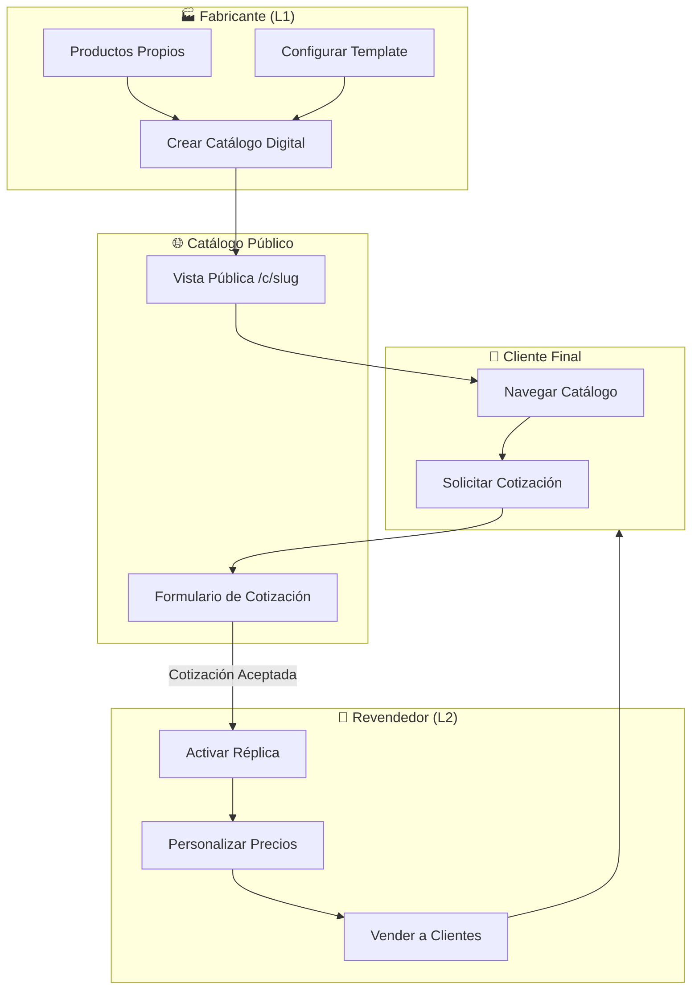
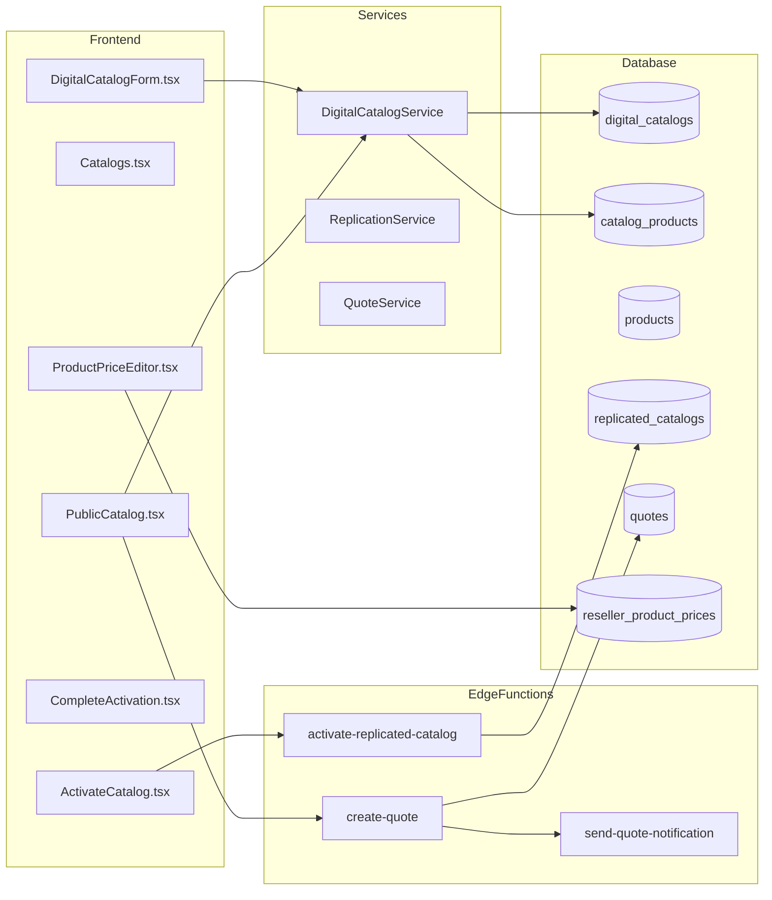
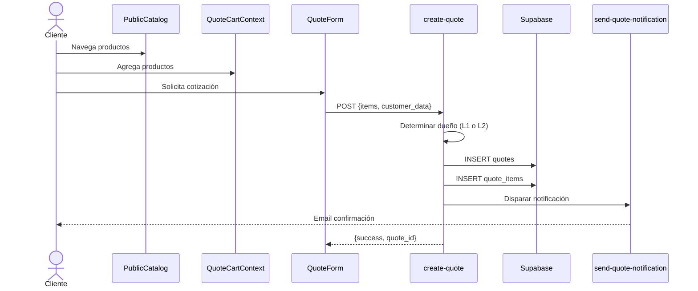
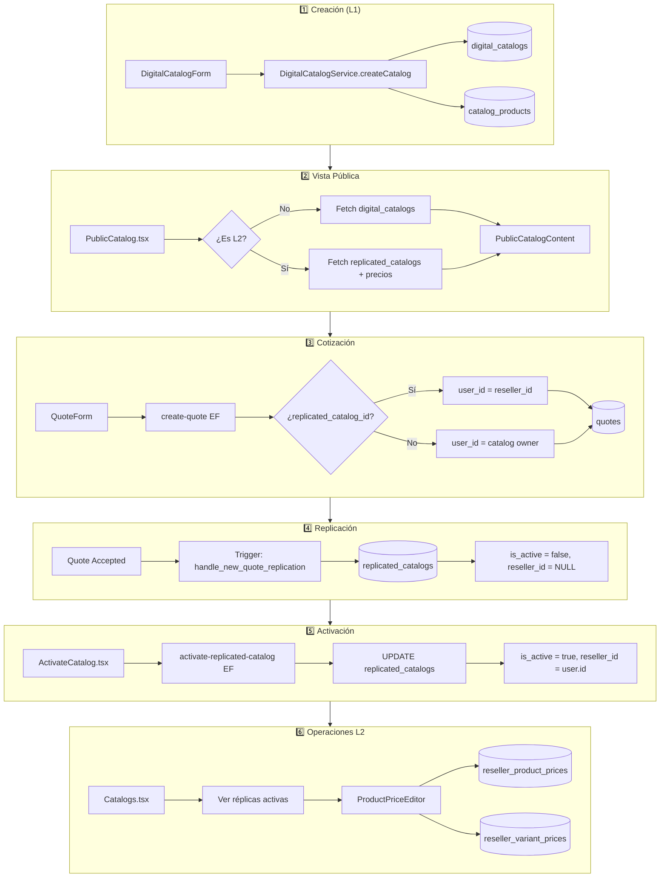

# Documentación Técnica: Sistema de Catálogos y Replicación

## Índice
1. [Visión General](#visión-general)
2. [Arquitectura del Sistema](#arquitectura-del-sistema)
3. [Fase 1: Creación de Catálogos (L1)](#fase-1-creación-de-catálogos-l1)
4. [Fase 2: Visualización Pública](#fase-2-visualización-pública)
5. [Fase 3: Cotizaciones desde Catálogos](#fase-3-cotizaciones-desde-catálogos)
6. [Fase 4: Replicación de Catálogos (L2)](#fase-4-replicación-de-catálogos-l2)
7. [Fase 5: Activación de Catálogos Replicados](#fase-5-activación-de-catálogos-replicados)
8. [Fase 6: Funcionamiento de Catálogos Replicados](#fase-6-funcionamiento-de-catálogos-replicados)
9. [Tablas de Supabase](#tablas-de-supabase)
10. [Edge Functions](#edge-functions)
11. [Funciones RPC de Base de Datos](#funciones-rpc-de-base-de-datos)
12. [Políticas RLS](#políticas-rls)
13. [Archivos del Frontend](#archivos-del-frontend)
14. [Flujo Completo de Datos](#flujo-completo-de-datos)

---

## Visión General

El sistema de catálogos de CatifyPro implementa un modelo de **distribución viral en dos niveles**:

- **L1 (Fabricante/Proveedor)**: Crea catálogos digitales con sus productos
- **L2 (Revendedor)**: Activa una réplica del catálogo L1, personaliza precios y vende a clientes finales



---

## Arquitectura del Sistema



---

## Fase 1: Creación de Catálogos (L1)

### Flujo de Usuario

1. Usuario L1 navega a `/catalogs/new`
2. Selecciona productos de su inventario
3. Configura template, precios, opciones de privacidad
4. Guarda el catálogo

### Archivo Principal: `src/pages/DigitalCatalogForm.tsx`

```typescript
// Líneas 195-298: Configuración del formulario con Zod
const catalogSchema = z.object({
  name: z.string().min(3).max(100),
  description: z.string().max(500).optional(),
  expires_at: z.date().min(new Date()),
  web_template_id: z.string().min(1),
  price_display: z.enum(["menudeo_only", "mayoreo_only", "both"]),
  price_adjustment_menudeo: z.number().min(-90).max(100),
  price_adjustment_mayoreo: z.number().min(-90).max(100),
  is_private: z.boolean(),
  access_password: z.string().optional(),
  product_ids: z.array(z.string()).min(1),
  enable_quotation: z.boolean(),
  enable_distribution: z.boolean(),
  // ... más campos
});
```

### Servicio: `src/services/digital-catalog.service.ts`

```typescript
// Método createCatalog (líneas 42-114)
static async createCatalog(userId: string, catalogData: CreateDigitalCatalogDTO): Promise<DigitalCatalog> {
  // 1. Verificar límites de plan
  const limitInfo = await this.checkCatalogLimit(userId);
  if (!limitInfo.can_create) throw new Error(limitInfo.message);
  
  // 2. Hash de contraseña si es privado
  let hashedPassword = null;
  if (catalogData.is_private && catalogData.access_password) {
    hashedPassword = await bcrypt.hash(catalogData.access_password, 10);
  }
  
  // 3. Generar slug único
  const { data: slugData } = await supabase.rpc("generate_catalog_slug");
  
  // 4. Insertar catálogo
  const { data: catalog } = await supabase
    .from("digital_catalogs")
    .insert({
      user_id: userId,
      name: catalogData.name,
      slug,
      // ... configuración completa
    })
    .select()
    .single();
  
  // 5. Vincular productos
  const catalogProducts = catalogData.product_ids.map((productId, index) => ({
    catalog_id: catalog.id,
    product_id: productId,
    sort_order: index,
  }));
  
  await supabase.from("catalog_products").insert(catalogProducts);
  
  return catalog;
}
```

### Componentes de Selección

| Componente | Archivo | Función |
|------------|---------|---------|
| ProductSelector | `src/components/catalog/ProductSelector.tsx` | Selección de productos del inventario |
| WebTemplateSelector | `src/components/templates/WebTemplateSelector.tsx` | Selección de template visual |
| PriceAdjustmentInput | `src/components/catalog/PriceAdjustmentInput.tsx` | Ajuste de precios % |
| BackgroundPatternSelector | `src/components/catalog/BackgroundPatternSelector.tsx` | Fondos decorativos |
| MarketingConfiguration | `src/components/catalog/marketing/MarketingConfiguration.tsx` | Pixel/CAPI config |

---

## Fase 2: Visualización Pública

### Rutas de Acceso

| Tipo | URL | Ejemplo |
|------|-----|---------|
| L1 Original | `/c/{slug}` | `/c/catalogo-verano-2024` |
| L2 Replicado | `/c/r-{hash}-{slug}` | `/c/r-abc123-catalogo-verano-2024` |
| Subdominio | `{subdomain}.catifypro.com` | `mi-tienda.catifypro.com` |

### Archivo Principal: `src/pages/PublicCatalog.tsx`

```typescript
// Líneas 82-232: Query de fetching con lógica híbrida L1/L2
const { data: catalog } = useQuery({
  queryKey: ["public-catalog", slug],
  queryFn: async () => {
    let catalogIdToFetch = null;
    let isReplicated = false;
    let replicatedCatalogId = undefined;
    let resellerId = undefined;
    
    // 1. Buscar como Catálogo Original (L1)
    let { data } = await supabase
      .from("digital_catalogs")
      .select(`*`)
      .eq("slug", slug)
      .maybeSingle();
    
    // 2. Si no existe, buscar como Réplica (L2)
    if (!data) {
      const { data: replica } = await supabase
        .from("replicated_catalogs")
        .select(`*, digital_catalogs (*)`)
        .eq("slug", slug)
        .maybeSingle();
      
      if (replica && replica.digital_catalogs) {
        catalogHeader = { ...replica.digital_catalogs };
        isReplicated = true;
        replicatedCatalogId = replica.id;
        resellerId = replica.reseller_id;
      }
    }
    
    // 3. Branding L2 (Sobrescribir datos del revendedor)
    if (isReplicated && resellerId) {
      const { data: businessInfo } = await supabase
        .from("business_info")
        .select("*")
        .eq("user_id", resellerId)
        .single();
      
      if (businessInfo) {
        catalogHeader.name = businessInfo.business_name;
        catalogHeader.logo_url = businessInfo.logo_url;
        // ...
      }
    }
    
    // 4. Fetch productos + hidratación de precios L2
    // ...
    
    return {
      ...catalogHeader,
      products: allProducts,
      isReplicated,
      replicatedCatalogId,
      resellerId,
    };
  }
});
```

### Componente de Contenido: `src/components/catalog/public/PublicCatalogContent.tsx`

| Función | Descripción |
|---------|-------------|
| Renderizado de productos | Grid responsivo con template dinámico |
| Búsqueda y filtros | Por categoría, tags, precio |
| Carrito de cotización | Context `QuoteCartProvider` |
| Modal de producto | Vista detallada con variantes |
| Formulario Radar | Solicitud de productos no encontrados |

```typescript
// Props del componente (líneas 69-87)
interface PublicCatalogContentProps {
  catalog: DigitalCatalog & {
    isReplicated?: boolean;
    resellerId?: string;
    replicatedCatalogId?: string;
    business_info?: {
      business_name?: string;
      logo_url?: string | null;
      phone?: string | null;
      email?: string | null;
      // ...
    };
  };
  onTrackEvent: (event: string, data?: any) => void;
}
```

---

## Fase 3: Cotizaciones desde Catálogos

### Flujo de Cotización



### Context del Carrito: `src/contexts/QuoteCartContext.tsx`

```typescript
interface QuoteItem {
  product: Product;
  quantity: number;
  priceType: "retail" | "wholesale";
  unitPrice: number;
  variantId: string | null;
  variantDescription: string | null;
}

interface QuoteCartContextType {
  items: QuoteItem[];
  addItem: (product, quantity, priceType, unitPrice, variantId?, variantDescription?) => void;
  updateQuantity: (productId, quantity, variantId?) => void;
  removeItem: (productId, variantId?) => void;
  clearCart: () => void;
  totalItems: number;
  totalAmount: number;
}
```

### Formulario: `src/components/public/QuoteForm.tsx`

```typescript
const handleSubmit = async (data) => {
  const payload = {
    catalog_id: catalog.id,
    replicated_catalog_id: catalog.replicatedCatalogId || null,
    customer_name: data.name,
    customer_email: data.email,
    customer_phone: data.phone,
    customer_company: data.company,
    delivery_method: data.deliveryMethod,
    shipping_address: data.shippingAddress,
    notes: data.notes,
    items: items.map(item => ({
      product_id: item.product.id,
      variant_id: item.variantId,
      product_name: item.product.name,
      product_sku: item.product.sku,
      product_image_url: item.product.image_url,
      variant_description: item.variantDescription,
      quantity: item.quantity,
      unit_price: item.unitPrice,
      price_type: item.priceType,
    }))
  };
  
  await supabase.functions.invoke("create-quote", { body: payload });
};
```

### Edge Function: `supabase/functions/create-quote/index.ts`

```typescript
// Líneas 42-84: Determinar dueño de la venta
let saleOwnerUserId = null;

if (payload.replicated_catalog_id) {
  // CASO L2: Venta del Revendedor
  const { data: replica } = await supabaseAdmin
    .from('replicated_catalogs')
    .select('reseller_id')
    .eq('id', payload.replicated_catalog_id)
    .single();
  
  saleOwnerUserId = replica.reseller_id;
} else {
  // CASO L1: Venta del Fabricante
  const { data: catalogOwner } = await supabaseAdmin
    .from('digital_catalogs')
    .select('user_id')
    .eq('id', payload.catalog_id)
    .single();
  
  saleOwnerUserId = catalogOwner.user_id;
}

// Insertar cotización con dueño correcto
const quoteToInsert = {
  catalog_id: payload.catalog_id,
  user_id: saleOwnerUserId,  // <-- L1 o L2 según el caso
  replicated_catalog_id: payload.replicated_catalog_id || null,
  // ...
};
```

---

## Fase 4: Replicación de Catálogos (L2)

### Trigger de Replicación Automática

Cuando un cliente acepta una cotización de un catálogo con `enable_distribution = true`, se crea automáticamente un registro "dormido" en `replicated_catalogs`.

### Función de Base de Datos: `handle_new_quote_replication`

```sql
CREATE OR REPLACE FUNCTION public.handle_new_quote_replication()
RETURNS trigger
LANGUAGE plpgsql
SECURITY DEFINER
AS $function$
DECLARE
  v_catalog_record RECORD;
  v_new_slug TEXT;
BEGIN
  -- 1. Obtener configuración del catálogo original
  SELECT enable_distribution, slug, user_id 
  INTO v_catalog_record
  FROM digital_catalogs 
  WHERE id = NEW.catalog_id;

  -- 2. Solo si permite viralidad
  IF v_catalog_record.enable_distribution = true THEN
    
    -- Generar slug único para réplica
    v_new_slug := 'r-' || substring(md5(random()::text) from 1 for 8) || '-' || v_catalog_record.slug;

    -- 3. Insertar catálogo HUÉRFANO (sin reseller_id)
    INSERT INTO public.replicated_catalogs (
      id,
      original_catalog_id,
      distributor_id,     -- El L1 (Dueño original)
      quote_id,           -- La cotización asociada
      reseller_id,        -- NULL (Esperando dueño)
      is_active,          -- FALSE (Inactivo)
      slug,
      activation_token,
      created_at
    ) VALUES (
      gen_random_uuid(),
      NEW.catalog_id,
      v_catalog_record.user_id,
      NEW.id,
      NULL,  -- Se asigna al activar
      false, -- Nace inactivo
      v_new_slug,
      encode(gen_random_bytes(16), 'hex'),
      now()
    );
  END IF;

  RETURN NEW;
END;
$function$;
```

### Servicio de Replicación: `src/services/replication.service.ts`

```typescript
// Obtener catálogo por token de activación
static async getCatalogByToken(token: string): Promise<CatalogByTokenResponse> {
  const { data, error } = await supabase.functions.invoke("get-catalog-by-token", {
    body: { token }
  });
  
  if (error) throw error;
  return data;
}

// Activar catálogo para un usuario
static async activateCatalog(data: ActivateReplicatedCatalogDTO): Promise<boolean> {
  const { error } = await supabase.functions.invoke("activate-replicated-catalog", {
    body: {
      token: data.token,
      userId: data.reseller_id
    }
  });
  
  return !error;
}
```

---

## Fase 5: Activación de Catálogos Replicados

### Flujo de Activación

```mermaid
sequenceDiagram
    actor Cliente as Cliente/Futuro L2
    participant Track as TrackQuotePage
    participant Activate as ActivateCatalog
    participant EF as activate-replicated-catalog
    participant DB as Supabase
    participant Dashboard as Dashboard L2
    
    Cliente->>Track: Recibe link tracking
    Track->>Track: Ver estado de cotización
    Note over Track: Link de activación visible
    Cliente->>Activate: Click "Activar Mi Negocio"
    Activate->>Activate: Login/Signup
    Activate->>EF: {token, userId}
    EF->>DB: Buscar catálogo por token
    EF->>DB: UPDATE replicated_catalogs SET is_active=true, reseller_id=userId
    EF-->>Activate: {success, catalogId}
    Activate->>Dashboard: Redirect
```

### Página de Activación: `src/pages/ActivateCatalog.tsx`

```typescript
// Líneas 44-49: Auto-activación cuando hay usuario
useEffect(() => {
  if (user && catalog && !catalog.is_active) {
    handleDirectActivation(user.id);
  }
}, [user, catalog]);

// Líneas 71-96: Lógica de activación
const handleDirectActivation = async (userId: string) => {
  await supabase.functions.invoke("activate-replicated-catalog", {
    body: {
      token,
      user_id: userId,
      strategy: "direct_link",
    },
  });
  
  toast({ title: "🎉 ¡Bienvenido a bordo!" });
  navigate("/dashboard");
};
```

### Edge Function: `supabase/functions/activate-replicated-catalog/index.ts`

```typescript
// Estrategia dual de búsqueda

// 1. Búsqueda Directa por activation_token
const { data: directCatalog } = await supabaseAdmin
  .from('replicated_catalogs')
  .select('id, is_active')
  .eq('activation_token', token)
  .maybeSingle();

if (directCatalog) {
  catalogIdToActivate = directCatalog.id;
  if (directCatalog.is_active) throw new Error('Ya activado');
} 

// 2. Búsqueda Indirecta por quote_tracking_token
else {
  const { data: trackingData } = await supabaseAdmin
    .from('quote_tracking_tokens')
    .select('quote_id')
    .eq('token', token)
    .maybeSingle();

  const { data: linkedCatalog } = await supabaseAdmin
    .from('replicated_catalogs')
    .select('id, is_active')
    .eq('quote_id', trackingData.quote_id)
    .maybeSingle();

  catalogIdToActivate = linkedCatalog.id;
}

// 3. Ejecutar activación ("El Casamiento")
await supabaseAdmin
  .from('replicated_catalogs')
  .update({
    is_active: true,
    reseller_id: userId,
    activated_at: new Date().toISOString()
  })
  .eq('id', catalogIdToActivate);
```

---

## Fase 6: Funcionamiento de Catálogos Replicados

### Vista de Catálogos L2: `src/pages/Catalogs.tsx`

```typescript
// Líneas 465-510: Query de catálogos replicados
const { data: replicatedCatalogs = [] } = useQuery({
  queryKey: ["replicated-catalogs", user?.id],
  queryFn: async () => {
    const { data } = await supabase
      .from("replicated_catalogs")
      .select(`
        id, slug, is_active, created_at,
        digital_catalogs (id, name, description, view_count)
      `)
      .eq("reseller_id", user.id)
      .eq("is_active", true);
    
    return data.map(rc => ({
      replicatedCatalogId: rc.id,
      replicatedSlug: rc.slug,
      originalName: rc.digital_catalogs.name,
      description: rc.digital_catalogs.description,
      view_count: rc.digital_catalogs.view_count,
      isActive: rc.is_active,
    }));
  },
});
```

### Personalización de Precios: `src/pages/reseller/ProductPriceEditor.tsx`

```typescript
// El revendedor puede modificar precios en:
// - reseller_product_prices (productos base)
// - reseller_variant_prices (variantes)

const savePrices = async (productId: string, newPrices: PriceOverride) => {
  await supabase
    .from("reseller_product_prices")
    .upsert({
      replicated_catalog_id: catalogId,
      product_id: productId,
      custom_price_retail: newPrices.retail,
      custom_price_wholesale: newPrices.wholesale,
      is_in_stock: newPrices.inStock,
    });
};
```

### Servicio de Precios: `src/services/reseller-price.service.ts`

```typescript
// Obtener precios personalizados
static async getCustomPrices(replicatedCatalogId: string) {
  const { data: productPrices } = await supabase
    .from("reseller_product_prices")
    .select("*")
    .eq("replicated_catalog_id", replicatedCatalogId);
  
  const { data: variantPrices } = await supabase
    .from("reseller_variant_prices")
    .select("*")
    .eq("replicated_catalog_id", replicatedCatalogId);
  
  return { productPrices, variantPrices };
}
```

---

## Tablas de Supabase

### `digital_catalogs` - Catálogos Originales

| Columna | Tipo | Descripción |
|---------|------|-------------|
| `id` | UUID | PK |
| `user_id` | UUID | FK → auth.users (Dueño L1) |
| `name` | TEXT | Nombre del catálogo |
| `slug` | TEXT | UNIQUE, URL amigable |
| `description` | TEXT | Descripción |
| `web_template_id` | TEXT | Template visual |
| `price_display` | TEXT | 'menudeo_only', 'mayoreo_only', 'both' |
| `price_adjustment_menudeo` | NUMERIC | Ajuste % precio menudeo |
| `price_adjustment_mayoreo` | NUMERIC | Ajuste % precio mayoreo |
| `is_private` | BOOLEAN | Requiere contraseña |
| `access_password` | TEXT | Hash de contraseña |
| `is_active` | BOOLEAN | Catálogo activo |
| `expires_at` | TIMESTAMP | Fecha de expiración |
| `enable_quotation` | BOOLEAN | Permite cotizaciones |
| `enable_distribution` | BOOLEAN | **Permite replicación viral** |
| `enable_variants` | BOOLEAN | Muestra variantes |
| `tracking_config` | JSONB | Configuración Pixel/CAPI |
| `view_count` | INTEGER | Contador de vistas |

### `catalog_products` - Relación Catálogo-Producto

| Columna | Tipo | Descripción |
|---------|------|-------------|
| `id` | UUID | PK |
| `catalog_id` | UUID | FK → digital_catalogs |
| `product_id` | UUID | FK → products |
| `sort_order` | INTEGER | Orden de visualización |

### `replicated_catalogs` - Catálogos Replicados (L2)

| Columna | Tipo | Descripción |
|---------|------|-------------|
| `id` | UUID | PK |
| `original_catalog_id` | UUID | FK → digital_catalogs |
| `distributor_id` | UUID | El L1 original |
| `reseller_id` | UUID | **El L2 que lo activa** |
| `quote_id` | UUID | FK → quotes (Cotización origen) |
| `slug` | TEXT | `r-{hash}-{slug_original}` |
| `activation_token` | TEXT | Token único de activación |
| `is_active` | BOOLEAN | **Solo true después de activación** |
| `activated_at` | TIMESTAMP | Fecha de activación |
| `expires_at` | TIMESTAMP | Expiración opcional |
| `custom_name` | TEXT | Nombre personalizado L2 |
| `custom_description` | TEXT | Descripción personalizada |
| `custom_logo_url` | TEXT | Logo del L2 |
| `tracking_config` | JSONB | Pixel/CAPI del L2 |

### `reseller_product_prices` - Precios Personalizados L2

| Columna | Tipo | Descripción |
|---------|------|-------------|
| `id` | UUID | PK |
| `replicated_catalog_id` | UUID | FK → replicated_catalogs |
| `product_id` | UUID | FK → products |
| `custom_price_retail` | BIGINT | Precio menudeo L2 |
| `custom_price_wholesale` | BIGINT | Precio mayoreo L2 |
| `stock_quantity` | INTEGER | Stock del L2 |
| `is_in_stock` | BOOLEAN | Disponibilidad L2 |

### `reseller_variant_prices` - Precios de Variantes L2

| Columna | Tipo | Descripción |
|---------|------|-------------|
| `id` | UUID | PK |
| `replicated_catalog_id` | UUID | FK → replicated_catalogs |
| `variant_id` | UUID | FK → product_variants |
| `custom_price_retail` | BIGINT | Precio menudeo variante |
| `custom_price_wholesale` | BIGINT | Precio mayoreo variante |
| `stock_quantity` | INTEGER | Stock del L2 |

### `distribution_network` - Red de Distribución

| Columna | Tipo | Descripción |
|---------|------|-------------|
| `id` | UUID | PK |
| `distributor_id` | UUID | El L1 |
| `reseller_id` | UUID | El L2 |
| `replicated_catalog_id` | UUID | FK → replicated_catalogs |
| `total_quotes_generated` | INTEGER | Cotizaciones generadas |
| `total_quotes_accepted` | INTEGER | Cotizaciones aceptadas |
| `conversion_rate` | NUMERIC | Tasa de conversión |

---

## Edge Functions

| Función | Archivo | Propósito |
|---------|---------|-----------|
| `create-quote` | `supabase/functions/create-quote/index.ts` | Crear cotización (L1 o L2) |
| `activate-replicated-catalog` | `supabase/functions/activate-replicated-catalog/index.ts` | Vincular L2 a catálogo |
| `get-catalog-by-token` | `supabase/functions/get-catalog-by-token/index.ts` | Obtener info por token |
| `send-quote-notification` | `supabase/functions/send-quote-notification/index.ts` | Email de nueva cotización |
| `generate-catalog-feed` | `supabase/functions/generate-catalog-feed/index.ts` | XML feed para Facebook |
| `track-catalog-view` | `supabase/functions/track-catalog-view/index.ts` | Analytics de vistas |

---

## Funciones RPC de Base de Datos

### `generate_catalog_slug()`
Genera slug único para catálogos.

### `check_catalog_limit(p_user_id UUID)`
Verifica si el usuario puede crear más catálogos según su plan.

### `can_create_private_catalog(p_user_id UUID)`
Verifica si el plan permite catálogos privados.

### `increment_catalog_views(p_catalog_id UUID)`
Incrementa contador de vistas.

### `handle_new_quote_replication()` (Trigger)
Crea automáticamente réplica huérfana cuando se acepta cotización.

### `generate_activation_token()`
Genera token alfanumérico único para activación.

---

## Políticas RLS

### `digital_catalogs`

```sql
-- Público puede ver catálogos activos no privados
CREATE POLICY "Public Read Active Catalogs Consolidated" ON digital_catalogs
FOR SELECT USING (
  is_active = true AND 
  is_private = false AND 
  (expires_at IS NULL OR expires_at > now())
);

-- Usuario autenticado ve los suyos
CREATE POLICY "Authenticated User Can View Own Catalog" ON digital_catalogs
FOR SELECT USING (auth.uid() = user_id);

-- CRUD completo para dueños
CREATE POLICY "Users can create catalogs" ON digital_catalogs
FOR INSERT WITH CHECK (auth.uid() = user_id);

CREATE POLICY "Users can update own catalogs" ON digital_catalogs
FOR UPDATE USING (auth.uid() = user_id);

CREATE POLICY "Users can delete own catalogs" ON digital_catalogs
FOR DELETE USING (auth.uid() = user_id);
```

### `replicated_catalogs`

```sql
-- L2 puede ver sus réplicas activas
CREATE POLICY "Resellers view own replicas" ON replicated_catalogs
FOR SELECT USING (reseller_id = auth.uid() AND is_active = true);

-- L1 puede ver todas las réplicas de sus catálogos
CREATE POLICY "Distributors view network" ON replicated_catalogs
FOR SELECT USING (distributor_id = auth.uid());

-- Sistema puede insertar (trigger)
CREATE POLICY "System insert replicas" ON replicated_catalogs
FOR INSERT WITH CHECK (true);
```

### `reseller_product_prices`

```sql
-- L2 gestiona sus precios
CREATE POLICY "Resellers manage own prices" ON reseller_product_prices
FOR ALL USING (
  EXISTS (
    SELECT 1 FROM replicated_catalogs rc
    WHERE rc.id = reseller_product_prices.replicated_catalog_id
    AND rc.reseller_id = auth.uid()
  )
);
```

---

## Archivos del Frontend

### Páginas

| Archivo | Ruta | Descripción |
|---------|------|-------------|
| `src/pages/DigitalCatalogForm.tsx` | `/catalogs/new`, `/catalogs/:id/edit` | Crear/editar catálogo |
| `src/pages/Catalogs.tsx` | `/catalogs` | Listar catálogos propios y replicados |
| `src/pages/PublicCatalog.tsx` | `/c/:slug` | Vista pública |
| `src/pages/ActivateCatalog.tsx` | `/activate?token=xxx` | Activar réplica |
| `src/pages/CompleteActivation.tsx` | `/complete-activation?token=xxx` | Completar activación |
| `src/pages/reseller/ProductPriceEditor.tsx` | `/reseller/edit-prices?catalog_id=xxx` | Editar precios L2 |

### Servicios

| Archivo | Clase/Métodos |
|---------|---------------|
| `src/services/digital-catalog.service.ts` | `DigitalCatalogService` - CRUD catálogos |
| `src/services/replication.service.ts` | `ReplicationService` - Replicación y activación |
| `src/services/reseller-price.service.ts` | `ResellerPriceService` - Precios L2 |
| `src/services/quote.service.ts` | `QuoteService` - Cotizaciones |

### Hooks

| Archivo | Hook | Uso |
|---------|------|-----|
| `src/hooks/useCatalogLimits.ts` | `useCatalogLimits` | Límites de plan |
| `src/hooks/useCatalogAnalytics.ts` | `useCatalogAnalytics` | Analytics |
| `src/hooks/useDistributionNetwork.ts` | `useDistributionNetwork` | Red de distribución |

### Componentes

| Carpeta | Componentes Clave |
|---------|-------------------|
| `src/components/catalog/` | ProductSelector, CatalogFormPreview, MarketingConfiguration |
| `src/components/catalog/public/` | PublicCatalogContent |
| `src/components/public/` | QuoteForm, QuoteCartModal, PublicProductCard |
| `src/components/templates/` | WebTemplateSelector, TemplatePreview |
| `src/components/reseller/` | ResellerCatalogsSection, BulkPriceMarginModal |

### Contexts

| Archivo | Context | Uso |
|---------|---------|-----|
| `src/contexts/QuoteCartContext.tsx` | `QuoteCartContext` | Carrito de cotización |

---

## Flujo Completo de Datos



---

## Consideraciones de Performance

1. **Índices críticos**:
   - `digital_catalogs(slug)` - Búsqueda por URL
   - `replicated_catalogs(slug)` - Búsqueda L2
   - `replicated_catalogs(activation_token)` - Activación
   - `catalog_products(catalog_id)` - JOIN con productos

2. **Caché de precios**:
   - Los precios personalizados se cargan con Map() para O(1) lookup
   - Uso de `??` (nullish coalescing) para respetar valores 0

3. **Lazy loading de productos**:
   - Imágenes con `loading="lazy"`
   - Grid virtualizado para catálogos grandes

---

## Variables de Entorno

| Variable | Uso |
|----------|-----|
| `SUPABASE_URL` | URL del proyecto Supabase |
| `SUPABASE_SERVICE_ROLE_KEY` | Key admin para Edge Functions |
| `RESEND_API_KEY` | Envío de emails |
| `SITE_URL` | URL base para links de activación |

---

## Troubleshooting Común

### "Catálogo no encontrado"
1. Verificar que `is_active = true`
2. Verificar que no esté expirado
3. Verificar slug correcto (L1 vs L2 con prefijo `r-`)

### "No se pudo activar"
1. Verificar que el token no haya expirado
2. Verificar que el catálogo no esté ya activado
3. Revisar logs de Edge Function

### "Precios no reflejan cambios L2"
1. Verificar que `replicated_catalog_id` sea correcto
2. Usar `??` en lugar de `||` para valores 0
3. Verificar Map de precios personalizados

---

*Documento generado: Diciembre 2024*
*Versión: 2.0*
