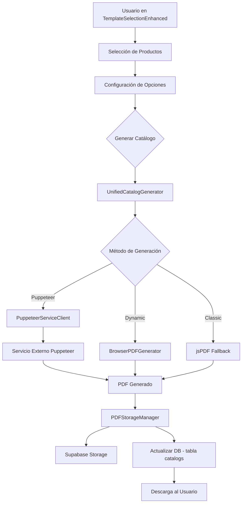
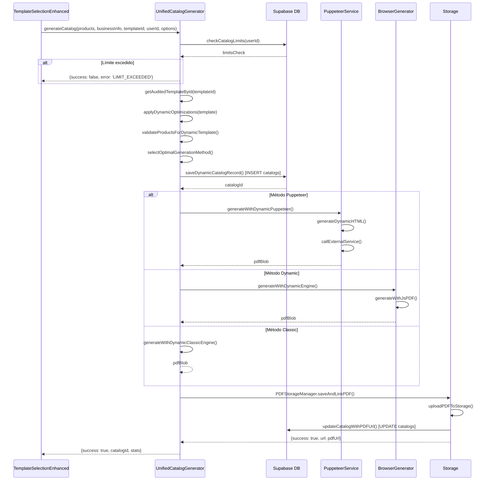
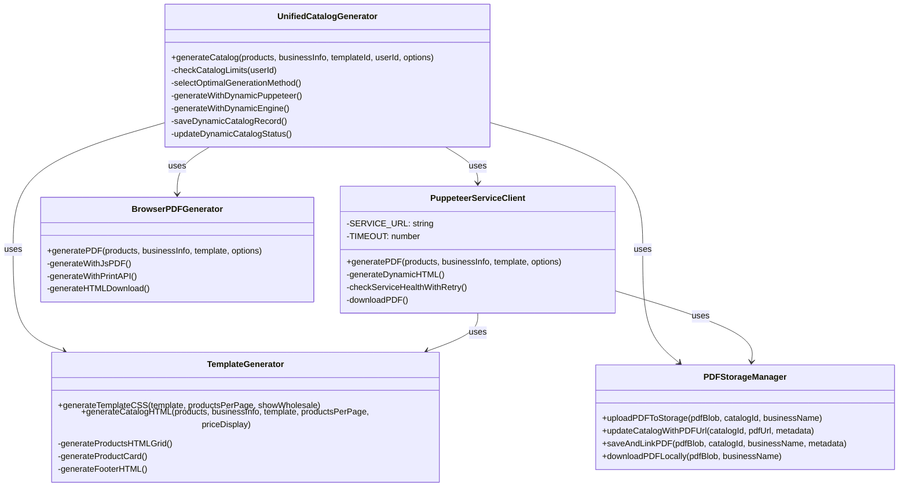

# Documentación Técnica: Sistema de Generación de Catálogos PDF

## Índice
1. [Arquitectura General](#arquitectura-general)
2. [Flujo de Generación](#flujo-de-generación)
3. [Archivos del Frontend](#archivos-del-frontend)
4. [Generadores PDF](#generadores-pdf)
5. [Sistema de Templates](#sistema-de-templates)
6. [Configuración de Precios](#configuración-de-precios)
7. [Base de Datos](#base-de-datos)
8. [Almacenamiento](#almacenamiento)
9. [Edge Functions](#edge-functions)
10. [Interfaces y Tipos](#interfaces-y-tipos)

---

## Arquitectura General



### Componentes Principales

| Componente | Archivo | Responsabilidad |
|------------|---------|-----------------|
| UI Principal | `TemplateSelectionEnhanced.tsx` | Interfaz de usuario para configuración |
| Orquestador | `unified-generator.ts` | Coordina todo el proceso de generación |
| Servicio Puppeteer | `puppeteer-service-client.ts` | Genera PDF de alta calidad |
| Generador Browser | `browser-pdf-generator.ts` | Fallback usando jsPDF |
| Generador CSS | `css-generator.ts` | Genera HTML/CSS para templates |
| Storage Manager | `pdf-uploader.ts` | Sube PDF a Supabase Storage |
| Templates | `industry-templates.ts` | Definición de templates |
| Templates Auditados | `audited-templates-v2.ts` | Templates verificados v2.0 |

---

## Flujo de Generación

### 1. Inicialización (TemplateSelectionEnhanced.tsx)

```typescript
// Carga de productos desde localStorage o router state
const loadSelectedProducts = async () => {
  let productsToUse: Product[] = [];
  const storedProducts = localStorage.getItem('selectedProductsData');
  if (storedProducts) {
    productsToUse = JSON.parse(storedProducts);
  }
  // Análisis de fondos de imágenes
  const analysis = analyzeBackgroundStatus(productsToUse);
  setBackgroundAnalysis(analysis);
  
  // Sugerencia automática de productos por página
  if (productsToUse.length <= 12) setProductsPerPage(4);
  else if (productsToUse.length >= 60) setProductsPerPage(9);
  else setProductsPerPage(6);
};
```

### 2. Configuración de Opciones

El usuario puede configurar:
- **Template**: Selección visual de template
- **Productos por página**: 4, 6, o 9
- **Modo de precios**: `menudeo_only`, `mayoreo_only`, o `both`
- **Preferencia de fondo**: Con fondo o sin fondo (processed)
- **Título del catálogo**: Personalizado

### 3. Ejecución de Generación

```typescript
const result = await generateCatalog(
  selectedProducts,
  businessInfo,
  selectedTemplate,
  user.id,
  {
    catalogTitle: catalogTitle,
    qualityCheck: true,
    autoFix: true,
    productsPerPage: productsPerPage,
    priceDisplay: priceDisplay // 'menudeo_only' | 'mayoreo_only' | 'both'
  }
);
```

### 4. Proceso en UnifiedCatalogGenerator



---

## Archivos del Frontend

### Componentes Principales

#### `src/components/enhanced/TemplateSelectionEnhanced.tsx`
**Líneas totales**: ~1024

**Responsabilidades**:
- Interfaz principal para selección de templates
- Gestión de productos seleccionados
- Configuración de opciones de generación
- Llamada al generador unificado

**Estados principales**:
```typescript
const [selectedTemplate, setSelectedTemplate] = useState<string | null>(null);
const [selectedProducts, setSelectedProducts] = useState<Product[]>([]);
const [generating, setGenerating] = useState(false);
const [productsPerPage, setProductsPerPage] = useState<4 | 6 | 9>(6);
const [priceDisplay, setPriceDisplay] = useState<'menudeo_only' | 'mayoreo_only' | 'both'>('both');
const [backgroundPreference, setBackgroundPreference] = useState<'with' | 'without'>('without');
const [catalogTitle, setCatalogTitle] = useState('');
```

**Funciones clave**:
| Función | Líneas | Descripción |
|---------|--------|-------------|
| `initializeComponent()` | 208-232 | Inicializa el componente y carga datos |
| `loadSelectedProducts()` | 234-315 | Carga productos del localStorage |
| `handleGenerateCatalog()` | 438-520 | Ejecuta la generación del catálogo |
| `getCatalogImageUrl()` | 102-124 | Selecciona la URL de imagen óptima |
| `analyzeBackgroundStatus()` | 126-138 | Analiza estado de fondos en imágenes |

#### `src/components/templates/SmartTemplateSelector.tsx`
Selector visual de templates con filtros por industria y densidad.

#### `src/components/templates/ProductsPerPageSelector.tsx`
Selector de 4, 6 o 9 productos por página con preview visual.

#### `src/components/enhanced/BackgroundSelector.tsx`
Selector de preferencia de fondo (con/sin) para imágenes.

---

## Generadores PDF

### 1. Generador Unificado (`src/lib/catalog/unified-generator.ts`)

**Líneas totales**: ~1645

**Clase principal**: `UnifiedCatalogGenerator`

**Interfaces**:
```typescript
interface GenerationOptions {
  useDynamicEngine?: boolean;
  usePuppeteerService?: boolean;
  showProgress?: boolean;
  onProgress?: (progress: number) => void;
  forceClassicMode?: boolean;
  qualityCheck?: boolean;
  autoFix?: boolean;
  skipAudit?: boolean;
  catalogTitle?: string;
  productsPerPage?: 4 | 6 | 9;
  priceDisplay?: 'menudeo_only' | 'mayoreo_only' | 'both';
  showWholesalePrices?: boolean; // Legacy compatibility
}

interface GenerationResult {
  success: boolean;
  catalogId?: string;
  htmlContent?: string;
  error?: string;
  message?: string;
  generationMethod?: 'puppeteer' | 'dynamic' | 'classic' | 'hybrid' | 'fallback';
  stats?: {
    totalProducts: number;
    totalPages: number;
    generationTime: number;
    templateQuality: number;
    productsPerPage?: 4 | 6 | 9;
    layoutOptimization?: string;
    grid2x2Fixed?: boolean;
  };
}
```

**Métodos principales**:

| Método | Líneas | Descripción |
|--------|--------|-------------|
| `generateCatalog()` | 88-520 | Función principal de generación |
| `checkCatalogLimits()` | 800-850 | Verifica límites de uso |
| `selectOptimalGenerationMethodDynamicFixed()` | 700-750 | Selecciona método óptimo |
| `generateWithDynamicPuppeteerFixed()` | 550-620 | Genera con Puppeteer |
| `generateWithDynamicEngineFixed()` | 620-680 | Genera con motor dinámico |
| `saveDynamicCatalogRecordFixed()` | 750-800 | Guarda registro en DB |
| `updateDynamicCatalogStatusFixed()` | 850-900 | Actualiza estado del catálogo |

**Selección de método**:
```typescript
static selectOptimalGenerationMethodDynamicFixed(
  productCount: number,
  template: IndustryTemplate,
  templateQuality: number,
  productsPerPage: 4 | 6 | 9,
  options: GenerationOptions
): 'puppeteer' | 'dynamic' | 'classic' {
  
  // Forzar modo clásico si se solicita
  if (options.forceClassicMode) return 'classic';
  
  // Puppeteer para alta calidad y muchos productos
  if (templateQuality >= 90 && productCount > 20) return 'puppeteer';
  
  // Dynamic para calidad media
  if (templateQuality >= 70) return 'dynamic';
  
  // Classic como fallback
  return 'classic';
}
```

### 2. Cliente Puppeteer (`src/lib/pdf/puppeteer-service-client.ts`)

**Líneas totales**: ~1712

**URL del servicio**: `https://min8n-puppeteer-pdf.fqr2ax.easypanel.host`

**Clase principal**: `PuppeteerServiceClient`

**Configuración por productos/página**:
```typescript
const getDynamicPDFLayout = (productsPerPage: 4 | 6 | 9 = 6) => {
  const layoutConfigs = {
    4: { // Grid 2x2
      HEADER_MARGIN: 7,
      FOOTER_MARGIN: 5,
      SIDE_MARGIN: 10,
      COLUMNS: 2,
      ROWS: 2,
      GRID_GAP: 3,
    },
    6: { // Grid 3x2 (estándar)
      HEADER_MARGIN: 15,
      FOOTER_MARGIN: 12,
      SIDE_MARGIN: 10,
      COLUMNS: 3,
      ROWS: 2,
      GRID_GAP: 5,
    },
    9: { // Grid 3x3
      HEADER_MARGIN: 6,
      FOOTER_MARGIN: 6,
      SIDE_MARGIN: 8,
      COLUMNS: 3,
      ROWS: 3,
      GRID_GAP: 4,
    }
  };
  return layoutConfigs[productsPerPage];
};
```

**Métodos principales**:
| Método | Descripción |
|--------|-------------|
| `generatePDF()` | Genera PDF llamando al servicio externo |
| `generateDynamicHTML()` | Genera HTML optimizado para el servicio |
| `checkServiceHealthWithRetry()` | Verifica disponibilidad del servicio |
| `getDynamicPDFOptions()` | Obtiene opciones dinámicas de PDF |
| `downloadPDF()` | Descarga el PDF generado |

### 3. Generador Browser (`src/lib/pdf/browser-pdf-generator.ts`)

**Líneas totales**: ~1091

**Dependencias**: `jspdf`, `html2canvas`

**Clase principal**: `BrowserPDFGenerator`

**Métodos de fallback**:
1. `generateWithJsPDF()` - Preferido, genera directamente con jsPDF
2. `generateWithPrintAPI()` - Usa Browser Print API
3. `generateHTMLDownload()` - Descarga HTML como último recurso

```typescript
static async generatePDF(
  products: Product[],
  businessInfo: BusinessInfo,
  template: SimpleDynamicTemplate,
  options: PDFGenerationOptions = {}
): Promise<PDFResult> {
  
  // Método 1: jsPDF directo (Preferido)
  const jspdfResult = await this.generateWithJsPDF(...);
  if (jspdfResult.success) return { ...jspdfResult, method: 'jspdf' };
  
  // Método 2: Browser Print API (Fallback)
  const printResult = await this.generateWithPrintAPI(...);
  if (printResult.success) return { ...printResult, method: 'print' };
  
  // Método 3: Descarga HTML (Último recurso)
  return await this.generateHTMLDownload(...);
}
```

### 4. Generador CSS (`src/lib/templates/css-generator.ts`)

**Líneas totales**: ~1796

**Clase principal**: `TemplateGenerator`

**Funciones principales**:

| Función | Líneas | Descripción |
|---------|--------|-------------|
| `generateTemplateCSS()` | 165-400 | Genera CSS completo del template |
| `generateCatalogHTML()` | 1468-1540 | Genera HTML completo del catálogo |
| `generateProductsHTMLGrid()` | 1550-1650 | Genera grid de productos |
| `generateProductCard()` | 1600-1750 | Genera tarjeta individual de producto |
| `generateFooterHTML()` | 1400-1468 | Genera footer con info de contacto |

**Configuración de precios**:
```typescript
static generateCatalogHTML(
  products: Product[],
  businessInfo: BusinessInfo,
  template: IndustryTemplate,
  productsPerPage: 4 | 6 | 9 = 6,
  priceDisplay: 'menudeo_only' | 'mayoreo_only' | 'both' = 'both',
  useBrandColors: boolean = true
): string {
  // ...
}

// En generateProductCard():
if (priceDisplay === 'menudeo_only') {
  priceHTML = `<div class="product-price-retail">${formatPrice(productPrice)}</div>`;
} else if (priceDisplay === 'mayoreo_only') {
  const displayPrice = product.price_wholesale || productPrice;
  priceHTML = `
    <div class="product-price-retail">${formatPrice(displayPrice)}</div>
    ${product.wholesale_min_qty ? `
      <div class="wholesale-min-badge">Min. ${product.wholesale_min_qty} pzas</div>
    ` : ''}
  `;
} else { // 'both'
  priceHTML = `
    <div class="product-price-retail">${formatPrice(productPrice)}</div>
    ${product.price_wholesale ? `
      <div class="product-price-wholesale">
        Mayoreo: ${formatPrice(product.price_wholesale)}
        ${product.wholesale_min_qty ? `(min. ${product.wholesale_min_qty})` : ''}
      </div>
    ` : ''}
  `;
}
```

---

## Sistema de Templates

### Estructura de Template (`IndustryTemplate`)

```typescript
interface IndustryTemplate {
  id: string;
  name: string;
  displayName: string;
  description: string;
  industry: IndustryType;
  density: ProductDensity;
  isPremium: boolean;
  
  productsPerPage: number;
  gridColumns: number;
  imageSize: { width: number; height: number; };
  
  colors: {
    primary: string;
    secondary: string;
    accent: string;
    background: string;
    text: string;
    cardBackground: string;
  };
  
  design: {
    borderRadius: number;
    shadows: boolean;
    spacing: 'compacto' | 'normal' | 'amplio';
  };
  
  showInfo: {
    description: boolean;
    sku: boolean;
    category: boolean;
    specifications: boolean;
    wholesalePrice?: boolean;
    wholesaleMinQty?: boolean;
  };
}
```

### Archivos de Templates

| Archivo | Descripción |
|---------|-------------|
| `industry-templates.ts` | Templates base por industria |
| `audited-templates-v2.ts` | Templates auditados v2.0 |
| `minimalist-templates.ts` | Templates minimalistas |
| `templates-enero-2025.ts` | Templates actualizados enero 2025 |
| `template-audit-system.ts` | Sistema de auditoría de calidad |
| `template-manager.ts` | Gestor de templates |

### Templates Auditados V2

Los templates auditados incluyen información adicional de compatibilidad:

```typescript
interface AuditedTemplate {
  id: string;
  displayName: string;
  version: '2.0';
  qualityScore: number; // 90-100
  
  compatibility: {
    puppeteer: true;
    dynamic: true;
    classic: true;
    browserPrint: true;
    mobileView: boolean;
  };
  
  scalability: {
    minProducts: number;
    maxProducts: number;
    optimalRange: [number, number];
  };
  
  auditResults: {
    layoutIssues: number;
    colorIssues: number;
    performanceIssues: number;
    compatibilityIssues: number;
    totalIssues: number;
  };
}
```

---

## Configuración de Precios

### Modos de Display

| Modo | Descripción | Campos mostrados |
|------|-------------|------------------|
| `menudeo_only` | Solo precio de menudeo | `price_retail` |
| `mayoreo_only` | Solo precio de mayoreo | `price_wholesale`, `wholesale_min_qty` |
| `both` | Ambos precios | `price_retail`, `price_wholesale`, `wholesale_min_qty` |

### Flujo de Configuración

1. **UI (TemplateSelectionEnhanced.tsx)**:
   ```typescript
   const [priceDisplay, setPriceDisplay] = useState<'menudeo_only' | 'mayoreo_only' | 'both'>('both');
   ```

2. **Generador (unified-generator.ts)**:
   ```typescript
   options.priceDisplay ?? 'both'
   ```

3. **HTML Generator (css-generator.ts)**:
   ```typescript
   TemplateGenerator.generateCatalogHTML(products, businessInfo, template, productsPerPage, priceDisplay);
   ```

---

## Base de Datos

### Tabla: `catalogs`

**Descripción**: Almacena los catálogos PDF generados.

| Campo | Tipo | Nullable | Default | Descripción |
|-------|------|----------|---------|-------------|
| `id` | uuid | NO | `uuid_generate_v4()` | ID único del catálogo |
| `user_id` | uuid | NO | - | ID del usuario propietario |
| `name` | text | NO | - | Nombre del catálogo |
| `description` | text | YES | - | Descripción opcional |
| `product_ids` | ARRAY | NO | - | Array de IDs de productos incluidos |
| `template_style` | text | YES | `'professional'` | ID del template usado |
| `brand_colors` | jsonb | YES | - | Colores de marca personalizados |
| `logo_url` | text | YES | - | URL del logo |
| `show_retail_prices` | boolean | YES | `true` | Mostrar precios de menudeo |
| `show_wholesale_prices` | boolean | YES | `false` | Mostrar precios de mayoreo |
| `currency` | text | YES | `'MXN'` | Moneda de los precios |
| `pdf_url` | text | YES | - | URL del PDF en Storage |
| `preview_image_url` | text | YES | - | URL de imagen preview |
| `total_products` | integer | NO | - | Total de productos |
| `total_pages` | integer | YES | - | Total de páginas |
| `file_size_bytes` | integer | YES | - | Tamaño del archivo |
| `credits_used` | integer | NO | - | Créditos consumidos |
| `created_at` | timestamptz | NO | `now()` | Fecha de creación |
| `generation_metadata` | jsonb | YES | - | Metadata de generación |

**Estructura de `generation_metadata`**:
```json
{
  "generation_method": "puppeteer" | "dynamic" | "classic",
  "products_per_page": 4 | 6 | 9,
  "template_quality": 98,
  "layout_config": { ... },
  "grid_2x2_fixed": true,
  "pdf_uploaded_at": "2024-01-15T...",
  "pdf_upload_success": true,
  "generation_time_ms": 5432
}
```

### Tabla: `catalog_usage`

**Descripción**: Rastrea el uso mensual de catálogos por usuario.

| Campo | Tipo | Nullable | Default | Descripción |
|-------|------|----------|---------|-------------|
| `id` | uuid | NO | `gen_random_uuid()` | ID único |
| `user_id` | uuid | NO | - | ID del usuario |
| `usage_month` | integer | NO | - | Mes de uso (YYYYMM) |
| `catalogs_generated` | integer | YES | `0` | Catálogos generados |
| `uploads_used` | integer | YES | `0` | Uploads usados |
| `subscription_plan_id` | uuid | YES | - | Plan de suscripción |
| `created_at` | timestamptz | NO | `now()` | Fecha de creación |
| `updated_at` | timestamptz | NO | `now()` | Última actualización |

### Tabla: `products`

**Campos relevantes para generación de catálogos**:

| Campo | Tipo | Descripción |
|-------|------|-------------|
| `id` | uuid | ID único del producto |
| `name` | text | Nombre del producto |
| `description` | text | Descripción |
| `price_retail` | numeric | Precio de menudeo |
| `price_wholesale` | numeric | Precio de mayoreo |
| `wholesale_min_qty` | integer | Cantidad mínima para mayoreo |
| `image_url` | text | URL de imagen principal |
| `original_image_url` | text | URL de imagen original |
| `processed_image_url` | text | URL de imagen sin fondo |
| `catalog_image_url` | text | URL optimizada para catálogo |
| `hd_image_url` | text | URL de imagen HD |
| `sku` | text | SKU del producto |
| `category` | text | Categoría |

### Tabla: `digital_catalogs`

**Nota**: Esta tabla es para catálogos web/digitales, NO para PDFs. El sistema PDF usa la tabla `catalogs`.

---

## Almacenamiento

### PDFStorageManager (`src/lib/storage/pdf-uploader.ts`)

**Bucket**: `catalogs` (Supabase Storage)

**Estructura de archivos**:
```
catalogs/
  └── {catalog_id}/
      └── catalog-{catalog_id}-{business_name}.pdf
```

**Métodos**:

```typescript
class PDFStorageManager {
  
  // Subir PDF a Storage
  static async uploadPDFToStorage(
    pdfBlob: Blob, 
    catalogId: string, 
    businessName: string
  ): Promise<{ success: boolean; url?: string; error?: string }>
  
  // Actualizar registro en DB con URL
  static async updateCatalogWithPDFUrl(
    catalogId: string, 
    pdfUrl: string, 
    additionalMetadata?: any
  ): Promise<{ success: boolean; error?: string }>
  
  // Proceso completo: subir + actualizar
  static async saveAndLinkPDF(
    pdfBlob: Blob,
    catalogId: string, 
    businessName: string,
    additionalMetadata?: any
  ): Promise<{ success: boolean; url?: string; error?: string }>
  
  // Descarga local
  static async downloadPDFLocally(
    pdfBlob: Blob, 
    businessName: string
  ): Promise<void>
}
```

---

## Edge Functions

### `update-catalog-pdf`

**Ubicación**: `supabase/functions/update-catalog-pdf/index.ts`

**Descripción**: Actualiza el estado y URL del PDF de un catálogo después de la generación.

**Request**:
```typescript
interface UpdateRequest {
  catalog_id: string;
  pdf_url?: string;
  preview_image_url?: string;
  file_size_bytes?: number;
  total_pages?: number;
  generation_status: 'processing' | 'completed' | 'failed';
  error_message?: string;
}
```

**Response**:
```typescript
{
  success: boolean;
  catalog?: CatalogRecord;
  message?: string;
  error?: string;
}
```

### Otros Edge Functions Relacionados

| Función | Descripción |
|---------|-------------|
| `check-catalog-limits` | Verifica límites de generación de catálogos |
| `track-catalog-view` | Registra vistas de catálogos |

---

## Interfaces y Tipos

### Product
```typescript
interface Product {
  id: string;
  name: string;
  description?: string;
  price_retail: number;
  price_wholesale?: number;
  wholesale_min_qty?: number;
  image_url: string;
  original_image_url?: string;
  processed_image_url?: string;
  catalog_image_url?: string;
  hd_image_url?: string;
  sku?: string;
  category?: string;
  specifications?: string;
}
```

### BusinessInfo
```typescript
interface BusinessInfo {
  business_name: string;
  email?: string;
  phone?: string;
  website?: string;
  address?: string;
  social_media?: {
    whatsapp?: string;
    facebook?: string;
    instagram?: string;
  };
  logo_url?: string;
  primary_color?: string;
  secondary_color?: string;
}
```

### GenerationOptions
```typescript
interface GenerationOptions {
  useDynamicEngine?: boolean;
  usePuppeteerService?: boolean;
  showProgress?: boolean;
  onProgress?: (progress: number) => void;
  forceClassicMode?: boolean;
  qualityCheck?: boolean;
  autoFix?: boolean;
  skipAudit?: boolean;
  catalogTitle?: string;
  productsPerPage?: 4 | 6 | 9;
  priceDisplay?: 'menudeo_only' | 'mayoreo_only' | 'both';
  showWholesalePrices?: boolean;
}
```

### GenerationResult
```typescript
interface GenerationResult {
  success: boolean;
  catalogId?: string;
  htmlContent?: string;
  error?: string;
  message?: string;
  generationMethod?: 'puppeteer' | 'dynamic' | 'classic' | 'hybrid' | 'fallback';
  stats?: {
    totalProducts: number;
    totalPages: number;
    generationTime: number;
    templateQuality: number;
    productsPerPage?: 4 | 6 | 9;
    layoutOptimization?: string;
    grid2x2Fixed?: boolean;
  };
  warnings?: string[];
}
```

### UsageLimits
```typescript
interface UsageLimits {
  canGenerate: boolean;
  catalogsUsed: number;
  catalogsLimit: number | 'unlimited';
  remainingCatalogs: number;
  message: string;
}
```

---

## Diagrama de Clases



---

## Hooks Relacionados

| Hook | Archivo | Descripción |
|------|---------|-------------|
| `useBusinessInfo` | `src/hooks/useBusinessInfo.ts` | Carga info del negocio |
| `useCatalogLimits` | `src/hooks/useCatalogLimits.ts` | Verifica límites de uso |
| `useProductsPerPage` | `src/hooks/useProductsPerPage.ts` | Gestiona productos por página |

---

## Notas de Implementación

### Grid 2x2 Fix
Para catálogos con 4 productos por página, existe un fix específico que garantiza que siempre se muestren 4 slots (incluso si hay menos productos), rellenando con cards vacías.

### Brand-Aware System
El sistema detecta automáticamente los colores primario y secundario del negocio y los aplica al template si están configurados.

### Fallback Chain
1. Puppeteer Service (alta calidad)
2. Dynamic Engine (jsPDF + html2canvas)
3. Classic Mode (jsPDF directo)
4. HTML Download (último recurso)

### Compatibilidad de Precios
El sistema mantiene retrocompatibilidad con el campo legacy `showWholesalePrices` mapeándolo a `priceDisplay`:
```typescript
if (options.showWholesalePrices && !options.priceDisplay) {
  options.priceDisplay = 'both';
}
```

---

*Última actualización: Enero 2025*
*Versión del sistema: 2.1 (Fix 2x2)*
