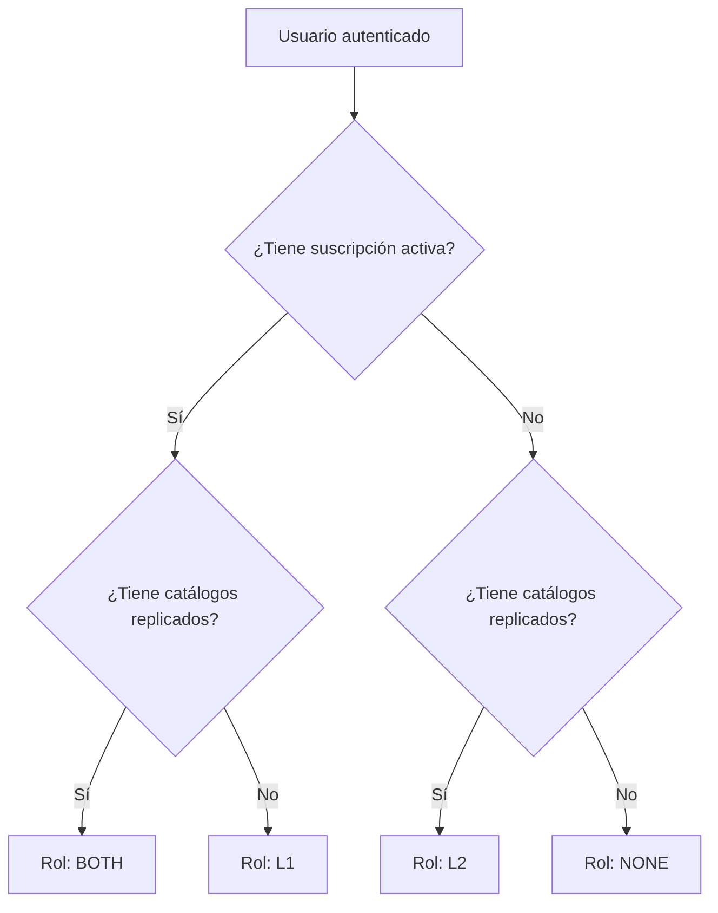
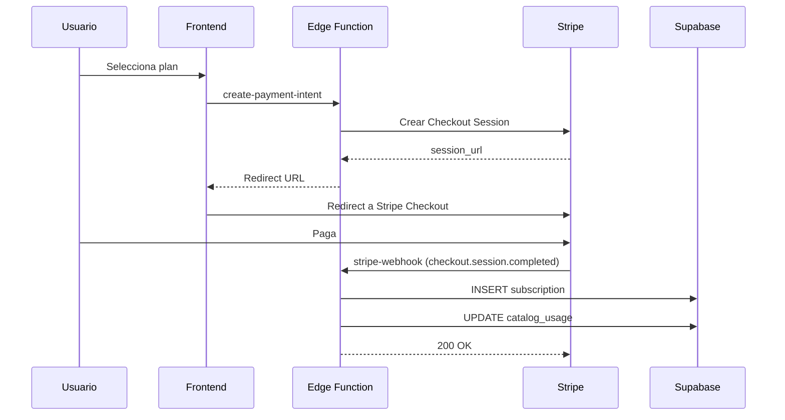
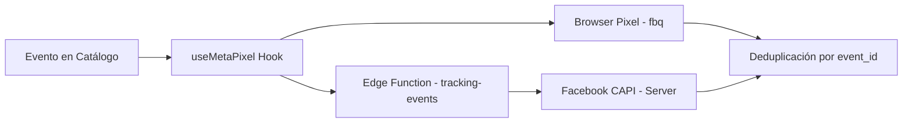
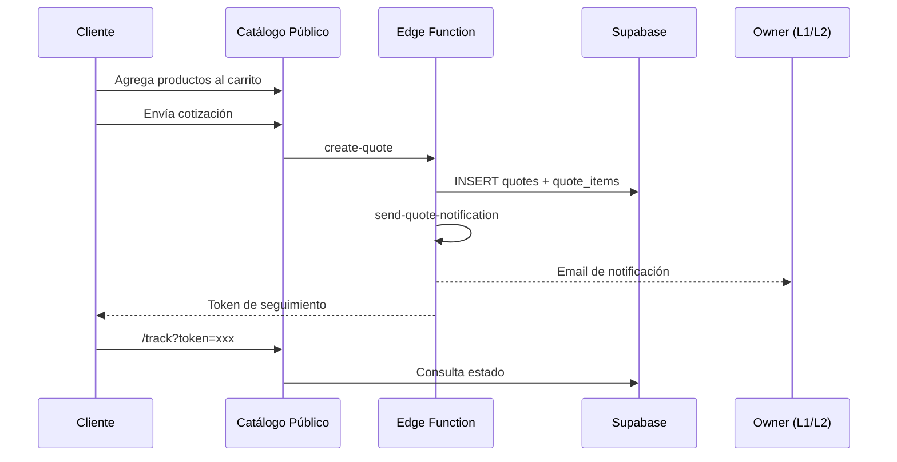
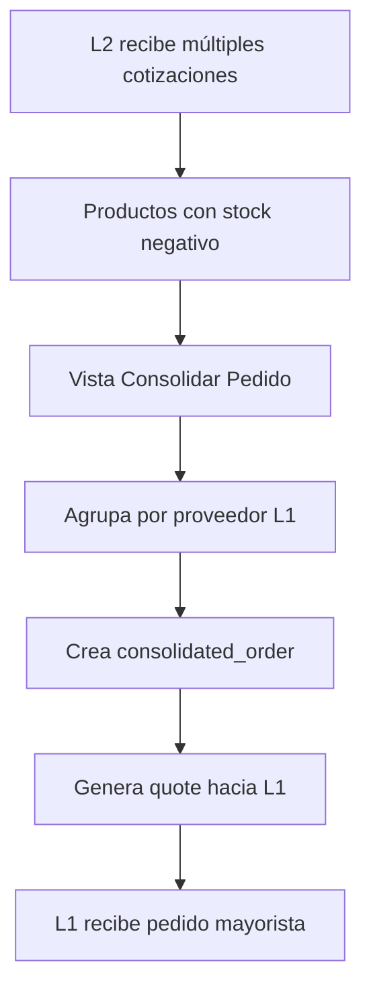

# Sistema de Planes y Suscripciones - Documentación Técnica Completa

## Resumen Ejecutivo

CatifyPro utiliza un sistema de suscripciones basado en roles (L1 Fabricante, L2 Revendedor) con múltiples niveles de plan que controlan el acceso a funcionalidades, límites de uso y características de IA.

---

## 1. Arquitectura de Roles

### 1.1 Definición de Roles (RoleContext.tsx)

```typescript
export type UserRole = "L1" | "L2" | "BOTH" | "NONE" | "LOADING";
```

| Rol | Descripción | Condición para Asignación |
|-----|-------------|---------------------------|
| **L1** | Fabricante/Proveedor | Usuario con suscripción activa en `subscriptions` (status: active/trialing) |
| **L2** | Revendedor/Distribuidor | Usuario con catálogos replicados activos en `replicated_catalogs` |
| **BOTH** | Híbrido | Usuario que cumple ambas condiciones (L1 + L2) |
| **NONE** | Sin rol activo | Usuario sin suscripción activa ni catálogos replicados (plan free sin actividad) |
| **LOADING** | Estado inicial | Mientras se determina el rol del usuario |

### 1.2 Flujo de Determinación de Rol



---

## 2. Estructura de Planes (credit_packages)

### 2.1 Planes Mensuales Activos

| Plan | ID | Precio MXN | Precio USD | Catálogos | Uploads/mes | Créditos IA | Analytics | Cotizador |
|------|----|-----------:|----------:|----------:|------------:|------------:|-----------|-----------|
| **Plan Gratis** | `8d9c9971-...` | $0 | $0 | 1 | 10 | 0 | none | ❌ |
| **Plan Catálogos** | `43fae58b-...` | $99 | ~$5 | 1 | 30 | 0 | basic | ✅ |
| **Plan Básico IA** | `7f4ea9f7-...` | $299 | ~$15 | 5 | 100 | 30 | advanced | ✅ |
| **Plan Profesional IA** | `b4fd4d39-...` | $599 | ~$30 | 30 | 900 | 50 | pro | ✅ |
| **Plan Empresarial IA** | `0bacec4c-...` | $1,299 | ~$65 | ∞ | ∞ | 100 | pro | ✅ |

### 2.2 Packs de Créditos (Add-ons)

| Pack | ID | Precio MXN | Créditos |
|------|----|-----------:|---------:|
| Pack 50 | `79a179e4-...` | $175 | 50 |
| Pack 100 | `a15da00c-...` | $299 | 100 |
| Pack 300 | `e5e0aa05-...` | $799 | 300 |

### 2.3 Campos Clave en `credit_packages`

```sql
CREATE TABLE credit_packages (
  id UUID PRIMARY KEY,
  name TEXT,                    -- Nombre del plan
  package_type TEXT,            -- 'monthly_plan' | 'addon'
  price_mxn INTEGER,            -- Precio en centavos MXN
  price_usd INTEGER,            -- Precio en centavos USD
  credits INTEGER,              -- Créditos IA incluidos
  max_catalogs INTEGER,         -- Límite catálogos (999999 = ilimitado)
  max_uploads INTEGER,          -- Límite uploads/mes (999999 = ilimitado)
  analytics_level TEXT,         -- 'none' | 'basic' | 'advanced' | 'pro'
  has_quotation BOOLEAN,        -- ¿Puede usar el cotizador?
  duration_months INTEGER,      -- Duración (1 = mensual, 0 = one-time)
  is_active BOOLEAN             -- ¿Visible para compra?
);
```

---

## 3. Límites y Restricciones por Funcionalidad

### 3.1 Catálogos Digitales

| Funcionalidad | Free | Catálogos | Básico IA | Profesional | Empresarial |
|---------------|:----:|:---------:|:---------:|:-----------:|:-----------:|
| **Catálogos activos** | 1 | 1 | 5 | 30 | ∞ |
| **Productos por catálogo** | 50 | 30 | 100 | 300 | 1000 |
| **Templates básicos** | ✅ | ✅ | ✅ | ✅ | ✅ |
| **Templates estándar** | ❌ | ❌ | ✅ | ✅ | ✅ |
| **Templates de temporada** | ❌ | ❌ | ❌ | ✅ | ✅ |
| **Marca de agua** | Sí | Sí | No | No | No |
| **Catálogos privados** | ❌ | ❌ | ❌ | ✅ | ✅ |
| **Personalizar colores** | ❌ | ❌ | ❌ | ✅ | ✅ |
| **Branding propio** | ❌ | ❌ | ✅ | ✅ | ✅ |

### 3.2 Sistema de Cotización (Quotes)

| Funcionalidad | Free | Catálogos | Básico IA | Profesional | Empresarial |
|---------------|:----:|:---------:|:---------:|:-----------:|:-----------:|
| **Cotizador habilitado** | ❌ | ✅ | ✅ | ✅ | ✅ |
| **Recibir cotizaciones** | ❌ | ✅ | ✅ | ✅ | ✅ |
| **Seguimiento de pedidos** | ❌ | ✅ | ✅ | ✅ | ✅ |
| **Notificaciones email** | ❌ | ✅ | ✅ | ✅ | ✅ |

### 3.3 Carga de Productos (Uploads)

| Límite | Free | Catálogos | Básico IA | Profesional | Empresarial |
|--------|:----:|:---------:|:---------:|:-----------:|:-----------:|
| **Uploads mensuales** | 10 | 30 | 100 | 900 | ∞ |
| **Carga masiva CSV** | ❌ | ❌ | ✅ | ✅ | ✅ |
| **Carga masiva imágenes** | ❌ | ❌ | ✅ | ✅ | ✅ |
| **Gestión de variantes** | ✅ | ✅ | ✅ | ✅ | ✅ |

### 3.4 Analytics y Dashboard

| Funcionalidad | Free | Catálogos | Básico IA | Profesional | Empresarial |
|---------------|:----:|:---------:|:---------:|:-----------:|:-----------:|
| **Dashboard básico** | ✅ | ✅ | ✅ | ✅ | ✅ |
| **Vistas de catálogo** | ❌ | ✅ | ✅ | ✅ | ✅ |
| **Métricas de cotización** | ❌ | ✅ | ✅ | ✅ | ✅ |
| **Gráficos de tendencia** | ❌ | ❌ | ✅ | ✅ | ✅ |
| **Radar de mercado (IA)** | ❌ | ❌ | ✅ | ✅ | ✅ |
| **Recomendaciones IA** | ❌ | ❌ | ❌ | ✅ | ✅ |
| **Análisis predictivo** | ❌ | ❌ | ❌ | ❌ | ✅ |

### 3.5 Funcionalidades de IA (Créditos)

| Funcionalidad | Créditos Usados | Disponible desde |
|---------------|----------------:|------------------|
| Remoción de fondo | 1 | Básico IA |
| Análisis inteligente de producto | 1 | Básico IA |
| Generación de descripción | 1 | Básico IA |
| Tags automáticos | 1 | Básico IA |
| Imagen HD | 2 | Profesional IA |
| Recomendaciones | - | Profesional IA |
| Análisis predictivo | - | Empresarial IA |

### 3.6 Red de Distribución (Réplicas)

| Funcionalidad | L1 (Fabricante) | L2 (Revendedor) |
|---------------|:---------------:|:---------------:|
| **Crear catálogos maestros** | ✅ | ❌ |
| **Habilitar distribución** | ✅ | ❌ |
| **Activar catálogos de L1** | ❌ | ✅ (Gratis) |
| **Personalizar precios** | ❌ | ✅ |
| **Configurar stock propio** | ❌ | ✅ |
| **Marketing/Pixel propio** | ❌ | ✅ |
| **Recibir cotizaciones** | ✅ | ✅ |
| **Pedidos consolidados** | ❌ | ✅ |

---

## 4. Validación de Límites

### 4.1 RPC Function: `can_generate_catalog`

```sql
-- Verifica si el usuario puede generar más catálogos
-- Retorna: can_generate, catalogs_used, catalogs_limit, message
SELECT * FROM can_generate_catalog(user_id);
```

### 4.2 Hook: `useCatalogLimits`

```typescript
const { canGenerate, catalogsUsed, maxCatalogs, checkLimits } = useCatalogLimits();
```

### 4.3 Hook: `useUploadTracking`

```typescript
const { 
  uploadsUsed, 
  maxUploads, 
  canUpload, 
  remaining,
  validateBeforeUpload,
  incrementUploadUsage 
} = useUploadTracking();
```

### 4.4 Hook: `useFeatureAccess`

```typescript
// Para features premium gated
const { isAllowed, UpsellComponent } = useFeatureAccess('radar_inteligente');
const { isAllowed, UpsellComponent } = useFeatureAccess('recomendaciones');
const { isAllowed, UpsellComponent } = useFeatureAccess('predictivo');
```

---

## 5. Sistema de Suscripciones

### 5.1 Tabla `subscriptions`

```sql
CREATE TABLE subscriptions (
  id UUID PRIMARY KEY,
  user_id UUID REFERENCES auth.users,
  package_id UUID REFERENCES credit_packages,
  status TEXT,                  -- 'active' | 'trialing' | 'canceled' | 'past_due'
  stripe_subscription_id TEXT,
  current_period_start TIMESTAMP,
  current_period_end TIMESTAMP,
  created_at TIMESTAMP
);
```

### 5.2 Flujo de Compra (Stripe)



### 5.3 Tabla `catalog_usage`

```sql
CREATE TABLE catalog_usage (
  id UUID PRIMARY KEY,
  user_id UUID,
  usage_month INTEGER,          -- Formato: YYYYMM (ej: 202512)
  catalogs_generated INTEGER,
  uploads_used INTEGER,
  subscription_plan_id UUID
);
```

---

## 6. Acceso por Secciones del Sidebar

| Sección | NONE | L1 | L2 | BOTH |
|---------|:----:|:--:|:--:|:----:|
| Dashboard | ✅ | ✅ | ✅ | ✅ |
| Cotizaciones | ❌ | ✅ | ✅ | ✅ |
| Mis Pedidos | ❌ | ✅ | ✅ | ✅ |
| Mis Catálogos | ✅ | ✅ | ✅ | ✅ |
| Radar de Mercado | ❌ | ✅ | ❌ | ✅ |
| Red de Distribución | ❌ | ✅ | ❌ | ✅ |
| Gestión de Productos | ✅ | ✅ | ❌ | ✅ |
| Inventario | ✅ | ✅ | ❌ | ✅ |
| Carga Masiva | ❌ | ✅ | ❌ | ✅ |
| Subir Productos | ✅ | ✅ | ❌ | ✅ |
| Analytics | ❌ | ✅ | ❌ | ✅ |
| Facturación | ✅ | ✅ | ❌ | ✅ |
| Guía de Inicio | ✅ | ✅ | ✅ | ✅ |
| Datos Bancarios | ❌ | ✅ | ✅ | ✅ |
| Configuración | ✅ | ✅ | ✅ | ✅ |

---

## 7. Feature Gating (SubscriptionContext)

### 7.1 Niveles de Analytics

| Nivel | Descripción | Planes |
|-------|-------------|--------|
| `none` | Sin analytics | Free |
| `basic` | Vistas básicas | Catálogos |
| `advanced` | + Gráficos, Radar IA | Básico IA |
| `pro` | + Recomendaciones, Predictivo | Profesional, Empresarial |

### 7.2 Función `hasAccess`

```typescript
const hasAccess = (feature: FeatureKey): boolean => {
  switch (feature) {
    case "radar_inteligente":
      return level === "advanced" || level === "pro";
    case "recomendaciones":
      return level === "pro";
    case "predictivo":
      return level === "pro" && planName.includes("empresarial");
    default:
      return false;
  }
};
```

---

## 8. Tracking y Marketing (CAPI)

### 8.1 Configuración por Tipo de Usuario

| Configuración | L1 (digital_catalogs) | L2 (replicated_catalogs) |
|---------------|:---------------------:|:------------------------:|
| Facebook Pixel ID | ✅ | ✅ |
| Access Token (CAPI) | ✅ | ✅ |
| Scripts personalizados | ✅ | ❌ |
| XML Feed dinámico | ✅ | ✅ |

### 8.2 Flujo Híbrido Pixel + CAPI



---

## 9. Catálogos Replicados (L2)

### 9.1 Tabla `replicated_catalogs`

```sql
CREATE TABLE replicated_catalogs (
  id UUID PRIMARY KEY,
  original_catalog_id UUID,     -- Catálogo maestro (L1)
  reseller_id UUID,             -- Usuario L2
  is_active BOOLEAN,
  custom_name TEXT,             -- Nombre personalizado
  custom_description TEXT,
  custom_logo_url TEXT,
  slug TEXT UNIQUE,             -- URL única del revendedor
  tracking_config JSONB         -- Pixel/CAPI del revendedor
);
```

### 9.2 Tablas de Precios Personalizados

```sql
-- Precios de productos simples
CREATE TABLE reseller_product_prices (
  id UUID PRIMARY KEY,
  replicated_catalog_id UUID,
  product_id UUID,
  custom_price_retail INTEGER,
  custom_price_wholesale INTEGER,
  is_in_stock BOOLEAN,
  stock_quantity INTEGER
);

-- Precios de variantes
CREATE TABLE reseller_variant_prices (
  id UUID PRIMARY KEY,
  replicated_catalog_id UUID,
  variant_id UUID,
  custom_price_retail INTEGER,
  custom_price_wholesale INTEGER,
  is_in_stock BOOLEAN,
  stock_quantity INTEGER
);
```

---

## 10. Flujos Críticos

### 10.1 Flujo de Cotización (Quote)



### 10.2 Flujo de Pedido Consolidado (L2)



---

## 11. Troubleshooting

### 11.1 Usuario Free no ve opciones en Sidebar

**Causa**: El rol es "NONE" y las rutas no incluían "NONE" en sus roles permitidos.

**Solución**: Agregar "NONE" a las rutas básicas (Dashboard, Catálogos, Configuración, etc.)

### 11.2 Límite de catálogos no funciona

**Verificar**:
```sql
SELECT * FROM subscriptions WHERE user_id = 'xxx' AND status = 'active';
SELECT * FROM catalog_usage WHERE user_id = 'xxx';
SELECT max_catalogs FROM credit_packages WHERE id = 'plan_id';
```

### 11.3 Créditos no se descuentan

**Verificar**:
```sql
SELECT * FROM credit_usage WHERE user_id = 'xxx' ORDER BY created_at DESC;
```

---

## 12. Consultas SQL de Diagnóstico

```sql
-- Ver plan activo de un usuario
SELECT s.*, cp.name, cp.max_catalogs, cp.max_uploads, cp.analytics_level
FROM subscriptions s
JOIN credit_packages cp ON s.package_id = cp.id
WHERE s.user_id = 'USER_ID' AND s.status = 'active';

-- Ver uso del mes actual
SELECT * FROM catalog_usage 
WHERE user_id = 'USER_ID' 
AND usage_month = TO_CHAR(NOW(), 'YYYYMM')::INTEGER;

-- Ver catálogos activos
SELECT COUNT(*) FROM digital_catalogs 
WHERE user_id = 'USER_ID' AND is_active = true;

-- Ver catálogos replicados (L2)
SELECT COUNT(*) FROM replicated_catalogs 
WHERE reseller_id = 'USER_ID' AND is_active = true;
```

---

## 13. Archivos Clave del Sistema

| Archivo | Propósito |
|---------|-----------|
| `src/contexts/RoleContext.tsx` | Determinación de rol L1/L2/BOTH/NONE |
| `src/contexts/SubscriptionContext.tsx` | Feature gating por analytics_level |
| `src/lib/web-catalog/plan-restrictions.ts` | Restricciones de templates y features |
| `src/hooks/useCatalogLimits.ts` | Validación de límite de catálogos |
| `src/hooks/useUploadTracking.ts` | Tracking de uploads mensuales |
| `src/hooks/useFeatureAccess.tsx` | Hook para features premium |
| `src/components/layout/AppSidebar.tsx` | Filtrado de navegación por rol |
| `supabase/functions/create-payment-intent/` | Creación de sesión Stripe |
| `supabase/functions/stripe-webhook/` | Activación de suscripciones |
| `supabase/functions/check-catalog-limits/` | Validación de límites |

---

*Última actualización: Diciembre 2024*
