# 📋 Flujo Técnico Completo de Cotizaciones (Quotes)

## 🎯 Visión General

El sistema de cotizaciones permite a los clientes solicitar presupuestos desde catálogos públicos (tanto originales L1 como replicados L2/L3). Este documento cubre el flujo completo desde la creación hasta la aceptación, incluyendo replicación de catálogos y manejo de inventario.

---

## 🏗️ Arquitectura del Sistema


---

## 📊 Modelo de Datos

### **Tabla: `quotes`**

```sql
CREATE TABLE quotes (
  id UUID PRIMARY KEY DEFAULT gen_random_uuid(),
  catalog_id UUID REFERENCES digital_catalogs(id),
  replicated_catalog_id UUID REFERENCES replicated_catalogs(id),
  user_id UUID, -- Dueño del catálogo (L1 o proveedor del L2)
  order_number TEXT UNIQUE, -- Ej: "CTF-A3B5K"
  
  -- Información del cliente
  customer_name TEXT NOT NULL,
  customer_email TEXT NOT NULL,
  customer_phone TEXT,
  customer_company TEXT,
  
  -- Detalles de entrega
  delivery_method delivery_method_enum, -- 'pickup' | 'shipping'
  shipping_address TEXT,
  shipping_cost INTEGER DEFAULT 0, -- Centavos
  
  -- Estado y montos
  status TEXT DEFAULT 'pending', -- 'pending' | 'accepted' | 'rejected' | 'shipped'
  total_amount INTEGER, -- Centavos
  items_count INTEGER,
  notes TEXT,
  
  -- Timestamps
  created_at TIMESTAMPTZ DEFAULT NOW(),
  updated_at TIMESTAMPTZ DEFAULT NOW(),
  
  -- Tracking
  tracking_token TEXT UNIQUE -- Para seguimiento público
);
```

### **Tabla: `quote_items`**

```sql
CREATE TABLE quote_items (
  id UUID PRIMARY KEY DEFAULT gen_random_uuid(),
  quote_id UUID NOT NULL REFERENCES quotes(id) ON DELETE CASCADE,
  
  -- Referencias (pueden ser NULL si el producto fue eliminado)
  product_id UUID REFERENCES products(id),
  variant_id UUID REFERENCES product_variants(id),
  
  -- Snapshot de datos (para histórico)
  product_name TEXT NOT NULL,
  product_sku TEXT,
  product_image_url TEXT,
  variant_description TEXT, -- Ej: "Color: Rojo, Talla: M"
  
  -- Precios y cantidades
  quantity INTEGER NOT NULL,
  unit_price INTEGER NOT NULL, -- Centavos (precio en el momento de la cotización)
  subtotal INTEGER NOT NULL, -- quantity * unit_price
  price_type TEXT, -- 'retail' | 'wholesale'
  
  created_at TIMESTAMPTZ DEFAULT NOW()
);
```

### **Tabla: `quote_tracking_tokens`**

```sql
CREATE TABLE quote_tracking_tokens (
  id UUID PRIMARY KEY DEFAULT gen_random_uuid(),
  quote_id UUID NOT NULL REFERENCES quotes(id),
  token TEXT UNIQUE NOT NULL, -- Ej: "trck_a1b2c3d4e5f6g7h8"
  expires_at TIMESTAMPTZ,
  last_accessed_at TIMESTAMPTZ,
  created_at TIMESTAMPTZ DEFAULT NOW()
);
```

---

## 🔄 Flujo Completo de Creación de Cotización

### **1. Cliente Navega al Catálogo Público**

**Archivo:** `src/pages/PublicCatalog.tsx`

```typescript
// 1. Se obtiene el catálogo por slug (puede ser L1 o L2)
const { data: catalog } = useQuery({
  queryKey: ["public-catalog", slug],
  queryFn: async () => {
    // Buscar en digital_catalogs (L1)
    let { data } = await supabase
      .from("digital_catalogs")
      .select("*")
      .eq("slug", slug)
      .maybeSingle();

    // Si no existe, buscar en replicated_catalogs (L2/L3)
    if (!data) {
      const { data: replica } = await supabase
        .from("replicated_catalogs")
        .select("*, digital_catalogs (*)")
        .eq("slug", slug)
        .maybeSingle();
      
      if (replica) {
        data = replica.digital_catalogs;
        isReplicated = true;
        resellerId = replica.reseller_id;
      }
    }

    // Obtener productos del catálogo
    const { data: rawProducts } = await supabase
      .from("catalog_products")
      .select("product_id, products (*)")
      .eq("catalog_id", data.id);

    return { ...data, products, isReplicated, resellerId };
  }
});
```

**Flujo L1 vs L2:**

```mermaid
sequenceDiagram
    participant C as Cliente
    participant PC as PublicCatalog
    participant DB as Supabase
    
    C->>PC: Visita /c/{slug}
    PC->>DB: SELECT * FROM digital_catalogs WHERE slug=?
    alt Catálogo L1 (Original)
        DB-->>PC: Catálogo encontrado
        PC->>DB: SELECT products via catalog_products
    else Catálogo L2 (Replicado)
        DB-->>PC: No encontrado
        PC->>DB: SELECT * FROM replicated_catalogs WHERE slug=?
        DB-->>PC: Replica encontrada
        PC->>DB: SELECT products del catálogo original
    end
    DB-->>PC: Productos
    PC-->>C: Renderiza catálogo con productos
```



---

### **2. Agregar Productos al Carrito de Cotización**

**Archivo:** `src/contexts/QuoteCartContext.tsx`

```typescript
interface QuoteItem {
  product: Product;
  quantity: number;
  priceType: 'retail' | 'wholesale';
  unitPrice: number; // Centavos
  variantId?: string | null;
  variantDescription?: string | null;
}

// Agregar producto al carrito
const addItem = useCallback((
  product: Product, 
  quantity: number, 
  priceType: 'retail' | 'wholesale', 
  unitPrice: number,
  variantId?: string | null,
  variantDescription?: string | null
) => {
  setItems(prev => {
    // Buscar si ya existe este producto con la misma variante
    const existingIndex = prev.findIndex(
      item => 
        item.product.id === product.id && 
        item.priceType === priceType &&
        item.variantId === variantId
    );
    
    if (existingIndex >= 0) {
      // Incrementar cantidad
      const updated = [...prev];
      updated[existingIndex].quantity += quantity;
      return updated;
    }
    
    // Agregar nuevo item
    return [...prev, { 
      product, 
      quantity, 
      priceType, 
      unitPrice,
      variantId,
      variantDescription
    }];
  });
}, []);
```

**Modal de Selección:**

`src/components/public/AddToQuoteModal.tsx`

```typescript
// Si el producto tiene variantes
{product.has_variants && (
  <VariantSelector
    variants={product.variants}
    selectedVariantId={selectedVariantId}
    onVariantChange={setSelectedVariantId}
  />
)}

// Calcular precio con ajustes del catálogo
const retailPrice = calculateAdjustedPrice(
  baseRetailPrice, 
  priceConfig.adjustmentMenudeo
);

const wholesalePrice = baseWholesalePrice 
  ? calculateAdjustedPrice(baseWholesalePrice, priceConfig.adjustmentMayoreo)
  : null;

// Determinar tipo de precio automáticamente
const priceType: 'retail' | 'wholesale' = 
  wholesalePrice && quantity >= wholesaleMinQty ? 'wholesale' : 'retail';
```

**Ajustes de Precio:**

Los catálogos replicados pueden tener ajustes de precio:

```typescript
// En digital_catalogs
price_adjustment_menudeo: number; // Ej: -10 = 10% descuento
price_adjustment_mayoreo: number; // Ej: +15 = 15% incremento

// Función de ajuste
export function calculateAdjustedPrice(
  basePrice: number, 
  adjustmentPercentage: number
): number {
  return Math.round(basePrice * (1 + adjustmentPercentage / 100));
}
```

---

### **3. Enviar Formulario de Cotización**

**Archivo:** `src/components/public/QuoteForm.tsx`

```typescript
const handleSubmit = async (formData: FormData) => {
  setIsSubmitting(true);
  
  try {
    // Preparar items
    const quoteItems = items.map(item => ({
      product_id: item.product.id,
      variant_id: item.variantId,
      product_name: item.product.name,
      product_sku: item.product.sku,
      product_image_url: item.product.processed_image_url,
      variant_description: item.variantDescription,
      quantity: item.quantity,
      unit_price: item.unitPrice,
      price_type: item.priceType,
    }));

    // Crear cotización
    const result = await QuoteService.createQuote({
      catalog_id: catalogId,
      replicated_catalog_id: replicatedCatalogId,
      customer_name: formData.customer_name,
      customer_email: formData.customer_email,
      customer_phone: formData.customer_phone,
      customer_company: formData.customer_company,
      delivery_method: formData.delivery_method,
      shipping_address: formData.shipping_address,
      notes: formData.notes,
      items: quoteItems,
    });

    // Analytics tracking
    if (typeof window.dataLayer !== 'undefined') {
      window.dataLayer.push({
        event: 'generate_lead',
        value: totalAmount / 100,
        currency: 'MXN',
      });
    }

    if (typeof window.fbq !== 'undefined') {
      window.fbq('track', 'Lead', {
        value: totalAmount / 100,
        currency: 'MXN',
        content_category: 'quote_request',
      });
    }

    setSubmitted(true);
    clearCart();
  } catch (error) {
    toast({ 
      title: "Error", 
      description: error.message, 
      variant: "destructive" 
    });
  } finally {
    setIsSubmitting(false);
  }
};
```

---

### **4. Edge Function: Crear Cotización**

**Archivo:** `supabase/functions/create-quote/index.ts`

```typescript
Deno.serve(async (req) => {
  const payload = await req.json();
  
  // 1. Inicializar Supabase con Service Role (ADMIN)
  const supabaseAdmin = createClient(
    Deno.env.get("SUPABASE_URL"),
    Deno.env.get("SUPABASE_SERVICE_ROLE_KEY"),
    { auth: { persistSession: false } }
  );

  // 2. Obtener dueño del catálogo
  const { data: catalogOwner } = await supabaseAdmin
    .from('digital_catalogs')
    .select('user_id')
    .eq('id', payload.catalog_id)
    .single();

  if (!catalogOwner) {
    throw new Error("Catálogo no encontrado");
  }

  // 3. Calcular total
  const totalAmount = payload.items.reduce(
    (sum, item) => sum + item.unit_price * item.quantity, 
    0
  );

  // 4. Insertar cabecera de cotización
  const { data: newQuote, error: quoteError } = await supabaseAdmin
    .from("quotes")
    .insert({
      catalog_id: payload.catalog_id,
      user_id: catalogOwner.user_id, // El dueño del catálogo
      customer_name: payload.customer_name,
      customer_email: payload.customer_email,
      customer_company: payload.customer_company,
      customer_phone: payload.customer_phone,
      notes: payload.notes,
      delivery_method: payload.delivery_method,
      shipping_address: payload.shipping_address,
      total_amount: totalAmount,
      items_count: payload.items.length,
      status: 'pending',
      replicated_catalog_id: payload.replicated_catalog_id
    })
    .select()
    .single();

  if (quoteError) {
    throw new Error(`Error al registrar cabecera: ${quoteError.message}`);
  }

  // 5. Insertar items de la cotización
  const itemsToInsert = payload.items.map((item) => ({
    quote_id: newQuote.id,
    product_id: item.product_id,
    variant_id: item.variant_id,
    product_name: item.product_name,
    product_sku: item.product_sku,
    product_image_url: item.product_image_url,
    variant_description: item.variant_description,
    quantity: item.quantity,
    unit_price: item.unit_price,
    price_type: item.price_type,
    subtotal: item.unit_price * item.quantity
  }));

  const { error: itemsError } = await supabaseAdmin
    .from("quote_items")
    .insert(itemsToInsert);

  if (itemsError) {
    // ROLLBACK: Borrar cabecera si fallan los items
    await supabaseAdmin.from('quotes').delete().eq('id', newQuote.id);
    throw new Error("Error al registrar ítems. Rollback ejecutado.");
  }

  // 6. Disparar notificación (async, non-blocking)
  try {
    await supabaseAdmin.functions.invoke('send-quote-notification', {
      body: { quoteId: newQuote.id }
    });
  } catch (e) {
    console.error('Error al invocar email function (no bloqueante):', e);
  }

  return new Response(
    JSON.stringify({ success: true, quote_id: newQuote.id }), 
    { status: 200 }
  );
});
```

**Trigger Automático: Generar Order Number**

```sql
CREATE OR REPLACE FUNCTION generate_order_number()
RETURNS TEXT AS $$
DECLARE
  chars TEXT := 'ABCDEFGHJKLMNPQRSTUVWXYZ23456789';
  result TEXT := 'CTF-';
BEGIN
  FOR i IN 1..5 LOOP
    result := result || substr(chars, floor(random() * length(chars) + 1)::int, 1);
  END LOOP;
  RETURN result;
END;
$$ LANGUAGE plpgsql;

CREATE TRIGGER assign_order_number
  BEFORE INSERT ON quotes
  FOR EACH ROW
  WHEN (NEW.order_number IS NULL)
  EXECUTE FUNCTION assign_order_number();
```

**Trigger Automático: Generar Tracking Token**

```sql
CREATE OR REPLACE FUNCTION generate_tracking_token()
RETURNS TRIGGER AS $$
DECLARE
  random_token TEXT;
BEGIN
  random_token := 'trck_' || lower(
    substring(md5(random()::text || clock_timestamp()::text) from 1 for 16)
  );
  
  INSERT INTO quote_tracking_tokens (quote_id, token, expires_at)
  VALUES (NEW.id, random_token, NOW() + INTERVAL '90 days');
  
  RETURN NEW;
END;
$$ LANGUAGE plpgsql;

CREATE TRIGGER generate_tracking_token
  AFTER INSERT ON quotes
  FOR EACH ROW
  EXECUTE FUNCTION generate_tracking_token();
```

---

### **5. Edge Function: Enviar Notificaciones**

**Archivo:** `supabase/functions/send-quote-notification/index.ts`

```typescript
Deno.serve(async (req) => {
  const { quoteId } = await req.json();
  
  const supabaseAdmin = createClient(/* ... */);

  // 1. Obtener cotización completa
  const { data: quote } = await supabaseAdmin
    .from('quotes')
    .select(`
      *,
      quote_items (*),
      digital_catalogs (*)
    `)
    .eq('id', quoteId)
    .single();

  // 2. Obtener datos del dueño
  const ownerData = await getOwnerData(supabaseAdmin, quote.user_id);

  // 3. Verificar suscripción para WhatsApp
  const { data: subscription } = await supabaseAdmin
    .from('subscriptions')
    .select('package_id, credit_packages (name)')
    .eq('user_id', quote.user_id)
    .eq('status', 'active')
    .single();

  const hasWhatsApp = subscription?.credit_packages?.name?.includes('Empresarial');

  // 4. Enviar Email (siempre)
  if (Deno.env.get('RESEND_API_KEY')) {
    await fetch('https://api.resend.com/emails', {
      method: 'POST',
      headers: {
        'Authorization': `Bearer ${Deno.env.get('RESEND_API_KEY')}`,
        'Content-Type': 'application/json'
      },
      body: JSON.stringify({
        from: 'CatifyPro <noreply@catifypro.com>',
        to: ownerData.email,
        subject: `Nueva Cotización #${quote.order_number}`,
        html: generateEmailTemplate(quote, ownerData)
      })
    });
  }

  // 5. Enviar WhatsApp (solo planes Empresarial)
  if (hasWhatsApp && Deno.env.get('TWILIO_ACCOUNT_SID')) {
    const message = generateWhatsAppMessage(quote, ownerData);
    
    await fetch(
      `https://api.twilio.com/2010-04-01/Accounts/${Deno.env.get('TWILIO_ACCOUNT_SID')}/Messages.json`,
      {
        method: 'POST',
        headers: {
          'Authorization': 'Basic ' + btoa(
            `${Deno.env.get('TWILIO_ACCOUNT_SID')}:${Deno.env.get('TWILIO_AUTH_TOKEN')}`
          ),
          'Content-Type': 'application/x-www-form-urlencoded'
        },
        body: new URLSearchParams({
          To: `whatsapp:${ownerData.phone}`,
          From: `whatsapp:${Deno.env.get('TWILIO_WHATSAPP_NUMBER')}`,
          Body: message
        })
      }
    );
  }

  return new Response(
    JSON.stringify({ 
      emailSent: true, 
      whatsappSent: hasWhatsApp 
    }), 
    { status: 200 }
  );
});
```

---

## 🎯 Flujo de Aceptación y Replicación

### **1. Dashboard: Ver Cotización**

**Archivo:** `src/pages/quotes/QuoteDetail.tsx`

```typescript
const { quote, loading, refetch } = useQuoteDetail(id);

const handleAcceptQuote = async () => {
  if (!quote || !user?.id) return;
  
  setActionLoading(true);
  try {
    // Actualizar estado a "accepted"
    await QuoteService.updateQuoteStatus(quote.id, user.id, "accepted");
    
    // Obtener link de tracking
    const trackingLink = await QuoteTrackingService.getTrackingLink(quote.id);
    setTrackingUrl(trackingLink);
    setShowWhatsAppButton(true);
    
    toast({ 
      title: "✅ Cotización aceptada", 
      description: "Cliente notificado." 
    });
    
    refetch();
  } catch (error) {
    toast({ 
      title: "Error", 
      description: error.message, 
      variant: "destructive" 
    });
  } finally {
    setActionLoading(false);
  }
};
```

---

### **2. Service: Actualizar Estado**

**Archivo:** `src/services/quote.service.ts`

```typescript
static async updateQuoteStatus(
  quoteId: string, 
  userId: string, 
  status: QuoteStatus,
  activationLink?: string
): Promise<Quote> {
  // 1. Verificar propiedad
  const { data: quote } = await supabase
    .from("quotes")
    .select("user_id")
    .eq("id", quoteId)
    .single();

  if (quote.user_id !== userId) {
    throw new Error("No autorizado");
  }

  // 2. Actualizar estado
  const { error } = await supabase
    .from("quotes")
    .update({ status })
    .eq("id", quoteId);

  if (error) throw error;

  // 3. Si se acepta, enviar email de aceptación
  if (status === "accepted") {
    await supabase.functions.invoke("send-quote-accepted-email", {
      body: { 
        quoteId,
        activationLink // Opcional: link de catálogo replicado
      },
    });
  }

  return quote;
}
```

---

### **3. Edge Function: Email de Aceptación + Replicación**

**Archivo:** `supabase/functions/send-quote-accepted-email/index.ts`

```typescript
Deno.serve(async (req) => {
  const { quoteId } = await req.json();
  
  const supabaseAdmin = createClient(/* ... */);

  // 1. Obtener cotización y catálogo
  const { data: quote } = await supabaseAdmin
    .from('quotes')
    .select(`
      *,
      digital_catalogs (enable_distribution)
    `)
    .eq('id', quoteId)
    .single();

  let activationLink = null;

  // 2. Si el catálogo tiene distribución habilitada, crear replica
  if (quote.digital_catalogs.enable_distribution) {
    // Buscar o crear token de replicación
    const { data: existingReplica } = await supabaseAdmin
      .from('replicated_catalogs')
      .select('activation_token')
      .eq('quote_id', quoteId)
      .maybeSingle();

    let token = existingReplica?.activation_token;

    // Crear replica si no existe
    if (!token) {
      const { data: newReplica } = await supabaseAdmin
        .rpc('create_replicated_catalog', {
          p_original_catalog_id: quote.catalog_id,
          p_quote_id: quoteId,
          p_distributor_id: quote.user_id
        });

      const { data: replica } = await supabaseAdmin
        .from('replicated_catalogs')
        .select('activation_token')
        .eq('id', newReplica)
        .single();

      token = replica.activation_token;
    }

    activationLink = `${Deno.env.get('PUBLIC_URL')}/activar/${token}`;
  }

  // 3. Actualizar estado de la cotización
  await supabaseAdmin
    .from('quotes')
    .update({ status: 'accepted' })
    .eq('id', quoteId);

  // 4. Obtener datos del dueño y cliente
  const ownerData = await getOwnerData(supabaseAdmin, quote.user_id);

  // 5. Enviar email al cliente
  await fetch('https://api.resend.com/emails', {
    method: 'POST',
    headers: {
      'Authorization': `Bearer ${Deno.env.get('RESEND_API_KEY')}`,
      'Content-Type': 'application/json'
    },
    body: JSON.stringify({
      from: 'CatifyPro <noreply@catifypro.com>',
      to: quote.customer_email,
      subject: `¡Tu cotización fue aceptada! 🎉`,
      html: generateAcceptedEmailTemplate(
        quote, 
        ownerData, 
        activationLink
      )
    })
  });

  return new Response(
    JSON.stringify({ 
      success: true, 
      activationLink 
    }), 
    { status: 200 }
  );
});
```

**Template del Email:**

```typescript
function generateAcceptedEmailTemplate(
  quote: any, 
  owner: any, 
  activationLink: string | null
): string {
  return `
    <!DOCTYPE html>
    <html>
    <body>
      <h1>¡Tu cotización #${quote.order_number} fue aceptada!</h1>
      
      <p>${owner.business_name} ha aceptado tu solicitud.</p>
      
      <h2>Resumen del Pedido</h2>
      <table>
        ${quote.items.map(item => `
          <tr>
            <td>${item.product_name}</td>
            <td>${item.quantity}x</td>
            <td>$${(item.unit_price / 100).toFixed(2)}</td>
          </tr>
        `).join('')}
      </table>
      
      <h3>Total: $${(quote.total_amount / 100).toFixed(2)}</h3>
      
      ${activationLink ? `
        <hr>
        <h2>🎁 ¡Conviértete en Revendedor!</h2>
        <p>Revende estos productos y gana comisiones.</p>
        <a href="${activationLink}">Activar mi catálogo gratis</a>
      ` : ''}
      
      <p>Para seguimiento: ${quote.tracking_token}</p>
    </body>
    </html>
  `;
}
```

---

### **4. RPC Function: Crear Catálogo Replicado**

**SQL Function:** `create_replicated_catalog`

```sql
CREATE OR REPLACE FUNCTION create_replicated_catalog(
  p_original_catalog_id UUID,
  p_quote_id UUID,
  p_distributor_id UUID
) RETURNS UUID
LANGUAGE plpgsql
SECURITY DEFINER
AS $$
DECLARE
  v_token TEXT;
  v_catalog_id UUID;
  v_expires_at TIMESTAMPTZ;
BEGIN
  -- 1. Generar token de activación
  v_token := generate_activation_token();
  v_expires_at := NOW() + INTERVAL '30 days';
  
  -- 2. Crear catálogo replicado
  INSERT INTO replicated_catalogs (
    original_catalog_id,
    quote_id,
    distributor_id,
    activation_token,
    expires_at,
    product_limit,
    is_active,
    activation_paid
  ) VALUES (
    p_original_catalog_id,
    p_quote_id,
    p_distributor_id,
    v_token,
    v_expires_at,
    50, -- Límite inicial de productos
    false, -- No activo hasta que se active
    false -- No se ha pagado aún
  )
  RETURNING id INTO v_catalog_id;
  
  RETURN v_catalog_id;
END;
$$;
```

**SQL Function:** `generate_activation_token`

```sql
CREATE OR REPLACE FUNCTION generate_activation_token()
RETURNS TEXT AS $$
DECLARE
  chars TEXT := 'abcdefghijklmnopqrstuvwxyz0123456789';
  result TEXT := 'ctfy_';
BEGIN
  FOR i IN 1..16 LOOP
    result := result || substr(chars, floor(random() * length(chars) + 1)::int, 1);
  END LOOP;
  RETURN result;
END;
$$ LANGUAGE plpgsql;
```

---

## 📦 Manejo de Inventario (Stock)

### ⚠️ **IMPORTANTE: NO HAY DESCUENTO AUTOMÁTICO DE STOCK**

El sistema **NO descuenta automáticamente el stock** cuando:
- Se crea una cotización
- Se acepta una cotización
- Se marca como enviada

**Razón:** Las cotizaciones son solicitudes de presupuesto, no órdenes de compra confirmadas. El descuento de stock debe hacerse manualmente cuando realmente se prepare el pedido.

---

### **Estructura de Stock**

#### **Sin Variantes:**
```sql
-- Stock en la tabla products
products {
  id UUID,
  stock_quantity INTEGER DEFAULT 0,
  has_variants BOOLEAN DEFAULT FALSE
}
```

#### **Con Variantes:**
```sql
-- Stock individual por variante
product_variants {
  id UUID,
  product_id UUID,
  stock_quantity INTEGER DEFAULT 0,
  variant_combination JSONB
}
```

---

### **Triggers de Inventario**

**Trigger:** `handle_stock_change` (en products y product_variants)

```sql
CREATE OR REPLACE FUNCTION handle_stock_change()
RETURNS TRIGGER AS $$
DECLARE
  diff INTEGER;
  current_user_id UUID;
BEGIN
  -- Calcular diferencia
  diff := NEW.stock_quantity - OLD.stock_quantity;
  
  IF diff = 0 THEN
    RETURN NEW;
  END IF;

  current_user_id := NEW.user_id;

  -- Registrar en inventory_logs
  INSERT INTO inventory_logs (
    user_id, 
    product_id, 
    variant_id, 
    previous_stock, 
    new_stock, 
    change_amount, 
    change_reason
  ) VALUES (
    current_user_id,
    CASE WHEN TG_TABLE_NAME = 'products' THEN NEW.id ELSE NEW.product_id END,
    CASE WHEN TG_TABLE_NAME = 'product_variants' THEN NEW.id ELSE NULL END,
    OLD.stock_quantity,
    NEW.stock_quantity,
    diff,
    CASE WHEN diff < 0 THEN 'sale' ELSE 'restock' END
  );

  -- Actualizar last_sale_at si es venta
  IF diff < 0 THEN
    NEW.last_sale_at := NOW();
  END IF;

  RETURN NEW;
END;
$$ LANGUAGE plpgsql;

-- Aplicar trigger
CREATE TRIGGER track_product_stock_changes
  BEFORE UPDATE ON products
  FOR EACH ROW
  WHEN (OLD.stock_quantity IS DISTINCT FROM NEW.stock_quantity)
  EXECUTE FUNCTION handle_stock_change();

CREATE TRIGGER track_variant_stock_changes
  BEFORE UPDATE ON product_variants
  FOR EACH ROW
  WHEN (OLD.stock_quantity IS DISTINCT FROM NEW.stock_quantity)
  EXECUTE FUNCTION handle_stock_change();
```

---

### **Cómo Descontar Stock Manualmente**

```typescript
// Ejemplo: Descontar stock al preparar pedido
async function decrementStock(quoteId: string) {
  const { data: items } = await supabase
    .from('quote_items')
    .select('product_id, variant_id, quantity')
    .eq('quote_id', quoteId);

  for (const item of items) {
    if (item.variant_id) {
      // Descontar de variante
      await supabase.rpc('decrement_variant_stock', {
        p_variant_id: item.variant_id,
        p_quantity: item.quantity
      });
    } else {
      // Descontar de producto base
      await supabase.rpc('decrement_product_stock', {
        p_product_id: item.product_id,
        p_quantity: item.quantity
      });
    }
  }
}
```

**RPC Functions para Descuento:**

```sql
-- Descontar stock de producto
CREATE OR REPLACE FUNCTION decrement_product_stock(
  p_product_id UUID,
  p_quantity INTEGER
) RETURNS BOOLEAN AS $$
BEGIN
  UPDATE products
  SET stock_quantity = GREATEST(0, stock_quantity - p_quantity)
  WHERE id = p_product_id;
  
  RETURN FOUND;
END;
$$ LANGUAGE plpgsql SECURITY DEFINER;

-- Descontar stock de variante
CREATE OR REPLACE FUNCTION decrement_variant_stock(
  p_variant_id UUID,
  p_quantity INTEGER
) RETURNS BOOLEAN AS $$
BEGIN
  UPDATE product_variants
  SET stock_quantity = GREATEST(0, stock_quantity - p_quantity)
  WHERE id = p_variant_id;
  
  RETURN FOUND;
END;
$$ LANGUAGE plpgsql SECURITY DEFINER;
```

---

## 🌐 Gestión de Precios en Catálogos Replicados

### **Precios Personalizados del Revendedor**

Los revendedores (L2/L3) pueden sobrescribir precios:

**Tabla:** `reseller_product_prices`

```sql
CREATE TABLE reseller_product_prices (
  id UUID PRIMARY KEY DEFAULT gen_random_uuid(),
  replicated_catalog_id UUID NOT NULL REFERENCES replicated_catalogs(id),
  product_id UUID NOT NULL REFERENCES products(id),
  custom_price_retail INTEGER,
  custom_price_wholesale INTEGER,
  is_in_stock BOOLEAN DEFAULT FALSE,
  stock_quantity INTEGER DEFAULT 0,
  created_at TIMESTAMPTZ DEFAULT NOW(),
  updated_at TIMESTAMPTZ DEFAULT NOW()
);
```

**Tabla:** `reseller_variant_prices`

```sql
CREATE TABLE reseller_variant_prices (
  id UUID PRIMARY KEY DEFAULT gen_random_uuid(),
  replicated_catalog_id UUID NOT NULL REFERENCES replicated_catalogs(id),
  variant_id UUID NOT NULL REFERENCES product_variants(id),
  custom_price_retail INTEGER,
  custom_price_wholesale INTEGER,
  is_in_stock BOOLEAN DEFAULT FALSE,
  stock_quantity INTEGER DEFAULT 0,
  created_at TIMESTAMPTZ DEFAULT NOW(),
  updated_at TIMESTAMPTZ DEFAULT NOW()
);
```

### **Lógica de Precios al Cotizar**

```typescript
// Al mostrar productos en catálogo replicado
async function getProductPriceForReplica(
  productId: string,
  variantId: string | null,
  replicaCatalogId: string
): Promise<{ retail: number; wholesale: number | null }> {
  
  // 1. Buscar precio personalizado del revendedor
  if (variantId) {
    const { data: customPrice } = await supabase
      .from('reseller_variant_prices')
      .select('custom_price_retail, custom_price_wholesale')
      .eq('replicated_catalog_id', replicaCatalogId)
      .eq('variant_id', variantId)
      .maybeSingle();
    
    if (customPrice) {
      return {
        retail: customPrice.custom_price_retail,
        wholesale: customPrice.custom_price_wholesale
      };
    }
  } else {
    const { data: customPrice } = await supabase
      .from('reseller_product_prices')
      .select('custom_price_retail, custom_price_wholesale')
      .eq('replicated_catalog_id', replicaCatalogId)
      .eq('product_id', productId)
      .maybeSingle();
    
    if (customPrice) {
      return {
        retail: customPrice.custom_price_retail,
        wholesale: customPrice.custom_price_wholesale
      };
    }
  }
  
  // 2. Si no hay precio personalizado, usar precio base con ajustes
  const { data: catalog } = await supabase
    .from('digital_catalogs')
    .select('price_adjustment_menudeo, price_adjustment_mayoreo')
    .eq('id', originalCatalogId)
    .single();
  
  // 3. Obtener precio base
  let baseRetail, baseWholesale;
  
  if (variantId) {
    const { data: variant } = await supabase
      .from('product_variants')
      .select('price_retail, price_wholesale')
      .eq('id', variantId)
      .single();
    
    baseRetail = variant.price_retail;
    baseWholesale = variant.price_wholesale;
  } else {
    const { data: product } = await supabase
      .from('products')
      .select('price_retail, price_wholesale')
      .eq('id', productId)
      .single();
    
    baseRetail = product.price_retail;
    baseWholesale = product.price_wholesale;
  }
  
  // 4. Aplicar ajustes
  return {
    retail: calculateAdjustedPrice(baseRetail, catalog.price_adjustment_menudeo),
    wholesale: baseWholesale 
      ? calculateAdjustedPrice(baseWholesale, catalog.price_adjustment_mayoreo)
      : null
  };
}
```

---

## 🔍 Queries Útiles para el Sistema

### **1. Obtener Cotizaciones del Usuario (L1)**

```typescript
// src/services/quote.service.ts
static async getUserQuotes(
  userId: string,
  filters?: { catalog_id?: string; status?: QuoteStatus }
): Promise<QuoteWithMetadata[]> {
  
  let query = supabase
    .from("quotes")
    .select(`
      *,
      digital_catalogs (name),
      replicated_catalogs (
        id,
        digital_catalogs!replicated_catalogs_original_catalog_id_fkey (name)
      )
    `)
    .eq("user_id", userId)
    .order("created_at", { ascending: false });

  if (filters?.catalog_id) {
    query = query.eq("catalog_id", filters.catalog_id);
  }

  if (filters?.status) {
    query = query.eq("status", filters.status);
  }

  const { data, error } = await query;

  if (error) throw error;

  // Enriquecer con metadatos
  const enriched = data.map(quote => ({
    ...quote,
    items_count: quote.items_count || 0,
    total_amount: quote.total_amount || 0,
    has_replicated_catalog: !!quote.replicated_catalogs,
    catalog_name: quote.digital_catalogs?.name || 
                  quote.replicated_catalogs?.digital_catalogs?.name || 
                  'Sin catálogo'
  }));

  return enriched;
}
```

### **2. Obtener Cotizaciones del Revendedor (L2/L3)**

```typescript
static async getResellerQuotes(
  resellerId: string
): Promise<Quote[]> {
  // Obtener catálogos replicados del revendedor
  const { data: replicas } = await supabase
    .from('replicated_catalogs')
    .select('original_catalog_id')
    .eq('reseller_id', resellerId);

  const catalogIds = replicas.map(r => r.original_catalog_id);

  // Obtener cotizaciones de esos catálogos
  const { data: quotes } = await supabase
    .from('quotes')
    .select('*')
    .in('catalog_id', catalogIds)
    .order('created_at', { ascending: false });

  return quotes;
}
```

### **3. Estadísticas de Cotizaciones**

```typescript
static async getQuoteStats(userId: string) {
  const { data } = await supabase
    .from('quotes')
    .select('status, total_amount')
    .eq('user_id', userId);

  const stats = {
    total: data.length,
    pending: data.filter(q => q.status === 'pending').length,
    accepted: data.filter(q => q.status === 'accepted').length,
    rejected: data.filter(q => q.status === 'rejected').length,
    shipped: data.filter(q => q.status === 'shipped').length,
    total_amount_accepted: data
      .filter(q => q.status === 'accepted')
      .reduce((sum, q) => sum + (q.total_amount || 0), 0)
  };

  return stats;
}
```

---

## 📱 Hooks React Importantes

### **useQuotes**

```typescript
// src/hooks/useQuotes.ts
export function useQuotes(options: UseQuotesOptions = {}) {
  const { user } = useAuth();
  const [quotes, setQuotes] = useState<QuoteWithMetadata[]>([]);
  const [loading, setLoading] = useState(false);
  const [stats, setStats] = useState({
    total: 0,
    pending: 0,
    accepted: 0,
    rejected: 0,
    shipped: 0,
    total_amount_accepted: 0,
  });

  const loadQuotes = async () => {
    if (!user) return;
    setLoading(true);
    
    try {
      const data = await QuoteService.getUserQuotes(user.id, {
        catalog_id: options.catalog_id,
        status: options.status,
      });
      
      setQuotes(data);
    } catch (error) {
      console.error("Error loading quotes:", error);
      toast({
        title: "Error",
        description: "No se pudieron cargar las cotizaciones",
        variant: "destructive",
      });
    } finally {
      setLoading(false);
    }
  };

  const updateStatus = async (quoteId: string, status: QuoteStatus) => {
    if (!user) return;
    
    await QuoteService.updateQuoteStatus(quoteId, user.id, status);
    setQuotes(prev => prev.map(q => 
      q.id === quoteId ? { ...q, status } : q
    ));
    
    toast({
      title: status === "accepted" ? "Cotización aceptada" : "Cotización rechazada",
      description: "El cliente será notificado del cambio",
    });
  };

  useEffect(() => {
    if (options.autoLoad !== false && user) {
      loadQuotes();
    }
  }, [user, options.catalog_id, options.status]);

  return {
    quotes,
    stats,
    loading,
    loadQuotes,
    updateStatus,
    refetch: loadQuotes,
  };
}
```

### **useQuoteDetail**

```typescript
// src/hooks/useQuoteDetail.ts
export function useQuoteDetail(quoteId: string | null) {
  const { user } = useAuth();
  const [quote, setQuote] = useState<Quote & { items: QuoteItem[] } | null>(null);
  const [loading, setLoading] = useState(false);

  const loadQuote = async () => {
    if (!user || !quoteId) return;
    
    setLoading(true);
    try {
      const data = await QuoteService.getQuoteDetail(quoteId, user.id);
      setQuote(data);
    } catch (error) {
      console.error('Error loading quote detail:', error);
      toast({
        title: 'Error',
        description: 'No se pudo cargar el detalle de la cotización',
        variant: 'destructive',
      });
    } finally {
      setLoading(false);
    }
  };

  useEffect(() => {
    if (quoteId && user) {
      loadQuote();
    }
  }, [quoteId, user]);

  return {
    quote,
    loading,
    refetch: loadQuote,
  };
}
```

---

## 🔐 RLS Policies (Seguridad)

### **Tabla: `quotes`**

```sql
-- Los clientes pueden crear cotizaciones (público)
CREATE POLICY "allow_public_quote_creation"
ON quotes FOR INSERT
TO anon
WITH CHECK (true);

-- Los dueños ven sus cotizaciones
CREATE POLICY "users_view_own_quotes"
ON quotes FOR SELECT
TO authenticated
USING (auth.uid() = user_id);

-- Los dueños actualizan sus cotizaciones
CREATE POLICY "users_update_own_quotes"
ON quotes FOR UPDATE
TO authenticated
USING (auth.uid() = user_id)
WITH CHECK (auth.uid() = user_id);

-- Lectura pública con token de tracking
CREATE POLICY "public_read_quotes_with_valid_token"
ON quotes FOR SELECT
TO anon
USING (
  EXISTS (
    SELECT 1 FROM quote_tracking_tokens
    WHERE quote_tracking_tokens.quote_id = quotes.id
    AND quote_tracking_tokens.expires_at > NOW()
  )
);
```

### **Tabla: `quote_items`**

```sql
-- Los clientes pueden crear items (público)
CREATE POLICY "allow_public_quote_items_creation"
ON quote_items FOR INSERT
TO anon
WITH CHECK (true);

-- Los dueños ven items de sus cotizaciones
CREATE POLICY "owners_view_their_quote_items"
ON quote_items FOR SELECT
TO authenticated
USING (
  EXISTS (
    SELECT 1 FROM quotes
    WHERE quotes.id = quote_items.quote_id
    AND quotes.user_id = auth.uid()
  )
);

-- Lectura pública para catálogos activos
CREATE POLICY "allow_read_quote_items_for_active_catalogs"
ON quote_items FOR SELECT
TO anon
USING (
  EXISTS (
    SELECT 1 FROM replicated_catalogs rc
    WHERE rc.quote_id = quote_items.quote_id
    AND rc.is_active = true
  )
  OR
  EXISTS (
    SELECT 1 FROM quotes q
    WHERE q.id = quote_items.quote_id
    AND q.user_id = auth.uid()
  )
);
```

---

## 📊 Diagrama Completo de Flujo

```mermaid
sequenceDiagram
    participant C as Cliente
    participant PC as PublicCatalog
    participant Cart as QuoteCart
    participant QF as QuoteForm
    participant EF1 as create-quote
    participant EF2 as send-notification
    participant DB as Supabase DB
    participant Owner as Dueño L1
    participant EF3 as send-accepted-email
    participant EF4 as create-replica
    
    C->>PC: Visita catálogo
    PC->>DB: Fetch products
    DB-->>PC: Products
    C->>Cart: Agrega productos
    Cart->>QF: Abrir formulario
    C->>QF: Llenar datos + Submit
    
    QF->>EF1: POST /create-quote
    EF1->>DB: INSERT quotes
    DB-->>EF1: quote.id
    EF1->>DB: INSERT quote_items
    EF1->>EF2: Invoke notification
    
    par Notificaciones Paralelas
        EF2->>Owner: Email notificación
        EF2->>Owner: WhatsApp (si tiene plan)
    end
    
    EF1-->>QF: { success, quote_id }
    QF-->>C: ✅ Cotización enviada
    
    Owner->>DB: Ver cotizaciones (Dashboard)
    Owner->>DB: Aceptar cotización
    DB->>EF3: send-accepted-email
    
    alt Catálogo con distribución
        EF3->>EF4: create_replicated_catalog
        EF4->>DB: INSERT replicated_catalogs
        DB-->>EF4: activation_token
        EF3->>C: Email con link de activación
    else Venta directa
        EF3->>C: Email de confirmación
    end
```



---

## 🎨 Componentes Frontend Clave

### **Estructura de Archivos**

```
src/
├── pages/
│   ├── PublicCatalog.tsx              # Catálogo público (L1 y L2)
│   └── quotes/
│       ├── index.tsx                  # Lista de cotizaciones
│       └── QuoteDetail.tsx            # Detalle de cotización
│
├── components/
│   └── public/
│       ├── QuoteCartModal.tsx         # Modal del carrito
│       ├── QuoteCartBadge.tsx         # Badge flotante
│       ├── QuoteForm.tsx              # Formulario de cotización
│       ├── AddToQuoteModal.tsx        # Modal agregar producto
│       └── PublicProductCard.tsx      # Card de producto
│
├── contexts/
│   └── QuoteCartContext.tsx           # Estado global del carrito
│
├── hooks/
│   ├── useQuotes.ts                   # Hook para lista de quotes
│   └── useQuoteDetail.ts              # Hook para detalle de quote
│
└── services/
    ├── quote.service.ts               # Servicios de cotizaciones
    └── replication.service.ts         # Servicios de replicación
```

---

## 🔄 Estados de Cotización

```typescript
type QuoteStatus = 
  | 'pending'   // Pendiente de revisión
  | 'accepted'  // Aceptada por el dueño
  | 'rejected'  // Rechazada por el dueño
  | 'shipped';  // Enviada al cliente
```

**Transiciones Válidas:**

```
pending → accepted → shipped
pending → rejected
```

**Acciones:**
- `pending → accepted`: Envía email de aceptación + crea catálogo replicado (si aplica)
- `accepted → shipped`: Actualiza estado + notifica al cliente
- `pending → rejected`: Solo actualiza estado

---

## 🚀 Flujo de Activación de Catálogo Replicado


---

## 📌 Puntos Clave de Implementación

### **1. Snapshots de Datos**

Los `quote_items` guardan un **snapshot** del producto en el momento de la cotización:

```typescript
interface QuoteItem {
  product_name: string;      // Nombre en ese momento
  product_sku: string;       // SKU en ese momento
  product_image_url: string; // Imagen en ese momento
  unit_price: number;        // Precio en ese momento
  variant_description: string; // Descripción de variante
}
```

**¿Por qué?** Si el producto se edita o elimina después, la cotización mantiene la información original.

---

### **2. Cálculo de Totales**

```typescript
// Total de la cotización
const totalAmount = items.reduce(
  (sum, item) => sum + (item.unit_price * item.quantity), 
  0
);

// Subtotal de un item
const subtotal = item.unit_price * item.quantity;
```

**Nota:** Todos los precios se manejan en **centavos** para evitar problemas de precisión con decimales.

---

### **3. Tracking Público**

Los clientes pueden rastrear su cotización sin autenticarse:

```typescript
// URL pública de tracking
const trackingUrl = `https://catifypro.com/track/${quote.tracking_token}`;

// RLS permite lectura pública con token válido
CREATE POLICY "public_read_quotes_with_valid_token"
ON quotes FOR SELECT TO anon
USING (
  EXISTS (
    SELECT 1 FROM quote_tracking_tokens
    WHERE quote_tracking_tokens.quote_id = quotes.id
    AND quote_tracking_tokens.expires_at > NOW()
  )
);
```

---

### **4. Prevención de Rollbacks**

En `create-quote`, si falla la inserción de items, se hace rollback de la cabecera:

```typescript
const { error: itemsError } = await supabaseAdmin
  .from("quote_items")
  .insert(itemsToInsert);

if (itemsError) {
  // ROLLBACK: Borrar cabecera
  await supabaseAdmin
    .from('quotes')
    .delete()
    .eq('id', newQuote.id);
    
  throw new Error("Rollback ejecutado");
}
```

---

## 📝 Resumen de Edge Functions

| Function | Propósito | Trigger |
|----------|-----------|---------|
| `create-quote` | Crear cotización + items | Frontend (QuoteForm) |
| `send-quote-notification` | Enviar email/WhatsApp al dueño | Invocada por create-quote |
| `send-quote-accepted-email` | Notificar aceptación + crear replica | Al aceptar cotización |
| `activate-replicated-catalog` | Activar catálogo del revendedor | Página de activación |

---

## 🔗 Links Relacionados

- **Documentación de Productos y Variantes:** `docs/PRODUCT_FLOW_TECHNICAL_DOCS.md` (pendiente)
- **Catálogos Digitales:** `docs/CATALOG_FILES_BREAKDOWN.md`
- **Replicación de Catálogos:** `docs/REPLICATION_FLOW_TECHNICAL_DOCS.md` (pendiente)

---

## ✅ Checklist de Implementación

- [x] Creación de cotizaciones desde catálogos públicos
- [x] Soporte para productos con y sin variantes
- [x] Ajustes de precio en catálogos replicados
- [x] Notificaciones por email y WhatsApp
- [x] Tracking público con tokens
- [x] Aceptación/rechazo de cotizaciones
- [x] Creación automática de catálogos replicados
- [x] Activación de catálogos por email (magic link)
- [x] RLS policies para seguridad
- [ ] Descuento automático de stock (pendiente de implementar si se requiere)
- [ ] Integración con pasarela de pago (pendiente)
- [ ] Sistema de comisiones para revendedores (pendiente)

---

**Última actualización:** 2025-11-23  
**Versión:** 1.0  
**Autor:** Sistema CatifyPro
