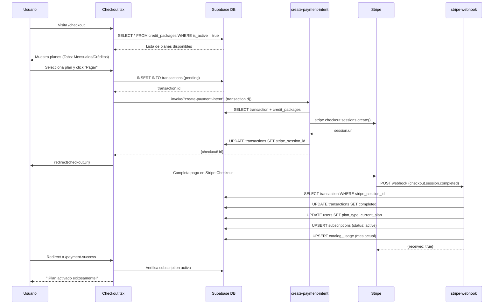
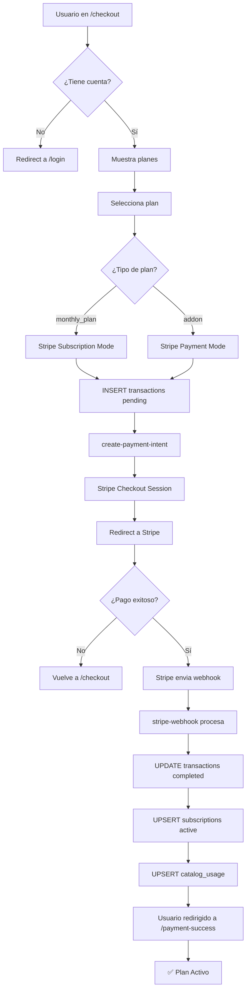

# Sistema de Suscripciones y Planes - Documentación Técnica

## Índice
1. [Resumen Ejecutivo](#resumen-ejecutivo)
2. [Arquitectura de Datos](#arquitectura-de-datos)
3. [Flujo de Compra Completo](#flujo-de-compra-completo)
4. [Tablas de Base de Datos](#tablas-de-base-de-datos)
5. [Validación de Límites por Plan](#validación-de-límites-por-plan)
6. [Edge Functions](#edge-functions)
7. [Contextos y Hooks de Frontend](#contextos-y-hooks-de-frontend)
8. [Restricciones de Features por Plan](#restricciones-de-features-por-plan)
9. [Diagramas de Flujo](#diagramas-de-flujo)
10. [Troubleshooting](#troubleshooting)

---

## 1. Resumen Ejecutivo

El sistema de suscripciones de CatifyPro gestiona:
- **Planes mensuales** con renovación automática via Stripe
- **Packs de créditos** (compra única) para procesamiento de imágenes con IA
- **Límites por plan**: catálogos, productos, uploads, features

### Tecnologías Involucradas
| Componente | Tecnología |
|------------|------------|
| Pagos | Stripe Checkout + Webhooks |
| Base de datos | Supabase PostgreSQL |
| Frontend | React + TypeScript |
| Validación | Edge Functions + RPC Functions |

---

## 2. Arquitectura de Datos

### Diagrama de Entidades

```
┌─────────────────────┐     ┌─────────────────────┐
│   credit_packages   │     │       users         │
│─────────────────────│     │─────────────────────│
│ id (PK)             │     │ id (PK)             │
│ name                │     │ email               │
│ credits             │     │ plan_type           │
│ price_mxn           │     │ current_plan (FK)   │
│ package_type        │     └─────────────────────┘
│ max_uploads         │              │
│ max_catalogs        │              │
│ analytics_level     │              │
│ has_quotation       │              │
└─────────────────────┘              │
         │                           │
         │                           ▼
         │              ┌─────────────────────┐
         │              │    subscriptions    │
         │              │─────────────────────│
         ▼              │ id (PK)             │
┌─────────────────────┐ │ user_id (FK)        │
│    transactions     │ │ package_id (FK)     │◄───┐
│─────────────────────│ │ stripe_sub_id       │    │
│ id (PK)             │ │ status              │    │
│ user_id (FK)        │ │ current_period_end  │    │
│ package_id (FK)     │ └─────────────────────┘    │
│ amount_mxn          │                            │
│ payment_method      │              │             │
│ payment_status      │              │             │
│ stripe_session_id   │              ▼             │
└─────────────────────┘ ┌─────────────────────┐    │
                        │    catalog_usage    │    │
                        │─────────────────────│    │
                        │ id (PK)             │    │
                        │ user_id (FK)        │    │
                        │ usage_month (YYYYMM)│    │
                        │ subscription_plan_id│────┘
                        │ catalogs_generated  │
                        │ uploads_used        │
                        └─────────────────────┘
```

---

## 3. Flujo de Compra Completo

### Diagrama de Secuencia



---

## 4. Tablas de Base de Datos

### 4.1 `credit_packages` - Definición de Planes

| Campo | Tipo | Descripción |
|-------|------|-------------|
| `id` | UUID | Identificador único del plan |
| `name` | TEXT | Nombre visible (ej: "Plan Básico IA") |
| `credits` | INT | Créditos IA incluidos por mes |
| `price_mxn` | INT | Precio en centavos MXN |
| `price_usd` | INT | Precio en centavos USD |
| `package_type` | TEXT | `monthly_plan` o `addon` |
| `max_uploads` | INT | Límite de productos/mes |
| `max_catalogs` | INT | Límite de catálogos activos (999999 = ilimitado) |
| `analytics_level` | TEXT | `none`, `basic`, `advanced`, `pro` |
| `has_quotation` | BOOL | ¿Tiene sistema de cotización? |
| `duration_months` | INT | Duración (1 para mensuales, 0 para addons) |
| `stripe_price_id` | TEXT | ID del precio en Stripe (opcional) |

#### Planes Actuales en Producción

| Plan | Precio MXN | Catálogos | Uploads | Créditos IA | Analytics |
|------|------------|-----------|---------|-------------|-----------|
| Plan Gratis | $0 | 1 | 10 | 0 | none |
| Plan Catálogos | $99 | 1 | 30 | 0 | basic |
| Plan Básico IA | $299 | 5 | 100 | 30 | advanced |
| Plan Profesional IA | $599 | 30 | 900 | 50 | pro |
| Plan Empresarial IA | $1,299 | ♾️ | ♾️ | 100 | pro |

### 4.2 `transactions` - Registro de Intentos de Pago

| Campo | Tipo | Descripción |
|-------|------|-------------|
| `id` | UUID | ID de la transacción |
| `user_id` | UUID | Usuario que compra |
| `package_id` | UUID | FK a credit_packages |
| `amount_mxn` | INT | Monto en centavos |
| `payment_method` | TEXT | `stripe`, `spei`, `conekta` |
| `payment_status` | TEXT | `pending`, `processing`, `completed`, `failed` |
| `purchase_type` | TEXT | `subscription` o `one_time` |
| `stripe_session_id` | TEXT | ID de sesión de Stripe Checkout |
| `stripe_payment_intent_id` | TEXT | ID del PaymentIntent |
| `completed_at` | TIMESTAMP | Fecha de completado |

### 4.3 `subscriptions` - Suscripciones Activas

| Campo | Tipo | Descripción |
|-------|------|-------------|
| `id` | UUID | ID de suscripción |
| `user_id` | UUID | Usuario suscrito (UNIQUE) |
| `package_id` | UUID | Plan actual |
| `stripe_subscription_id` | TEXT | ID de sub en Stripe |
| `stripe_customer_id` | TEXT | ID de cliente en Stripe |
| `status` | TEXT | `active`, `trialing`, `canceled`, `past_due` |
| `current_period_start` | TIMESTAMP | Inicio del período |
| `current_period_end` | TIMESTAMP | Fin del período |
| `cancel_at_period_end` | BOOL | ¿Cancelará al renovar? |

### 4.4 `catalog_usage` - Tracking de Uso Mensual

| Campo | Tipo | Descripción |
|-------|------|-------------|
| `id` | UUID | ID del registro |
| `user_id` | UUID | Usuario |
| `usage_month` | INT | Mes en formato YYYYMM (ej: 202412) |
| `subscription_plan_id` | UUID | Plan activo en ese mes |
| `catalogs_generated` | INT | Catálogos creados este mes |
| `uploads_used` | INT | Productos subidos este mes |

### 4.5 `credit_usage` - Consumo de Créditos IA

| Campo | Tipo | Descripción |
|-------|------|-------------|
| `id` | UUID | ID del registro |
| `user_id` | UUID | Usuario |
| `usage_type` | TEXT | `background_removal`, `enhancement`, etc. |
| `credits_used` | INT | Créditos consumidos |
| `credits_remaining` | INT | Saldo restante |
| `product_id` | UUID | Producto procesado (opcional) |

---

## 5. Validación de Límites por Plan

### 5.1 Dónde se Validan los Límites

| Límite | Archivo | Función/Hook |
|--------|---------|--------------|
| Catálogos activos | `useCatalogLimits.ts` | `checkLimits()` via RPC `can_generate_catalog` |
| Uploads mensuales | `useUploadTracking.ts` | `checkUploadLimits()` |
| Features por plan | `plan-restrictions.ts` | `canUseTemplate()`, `canCreateMoreCatalogs()` |
| Acceso Analytics | `SubscriptionContext.tsx` | `hasAccess('radar_inteligente')` |

### 5.2 Función RPC: `can_generate_catalog`

```sql
-- Ubicación: Database Functions
-- Llamada desde: useCatalogLimits.ts

CREATE FUNCTION can_generate_catalog(p_user_id UUID)
RETURNS JSON AS $$
DECLARE
  v_max_catalogs INT;
  v_current_count INT;
  v_plan_name TEXT;
BEGIN
  -- 1. Obtener límite del plan
  SELECT cp.max_catalogs, cp.name
  INTO v_max_catalogs, v_plan_name
  FROM subscriptions s
  JOIN credit_packages cp ON s.package_id = cp.id
  WHERE s.user_id = p_user_id AND s.status = 'active';
  
  -- 2. Contar catálogos activos
  SELECT COUNT(*) INTO v_current_count
  FROM digital_catalogs
  WHERE user_id = p_user_id AND is_active = true;
  
  -- 3. Evaluar (999999 = ilimitado)
  IF v_max_catalogs >= 999999 THEN
    RETURN json_build_object(
      'can_generate', true,
      'catalogs_limit', 'unlimited',
      'catalogs_used', v_current_count
    );
  END IF;
  
  RETURN json_build_object(
    'can_generate', v_current_count < v_max_catalogs,
    'catalogs_limit', v_max_catalogs,
    'catalogs_used', v_current_count,
    'remaining', v_max_catalogs - v_current_count
  );
END;
$$ LANGUAGE plpgsql;
```

### 5.3 Hook: `useUploadTracking`

```typescript
// Ubicación: src/hooks/useUploadTracking.ts
// Uso: Validar antes de subir productos

const checkUploadLimits = async (filesToUpload: number) => {
  // 1. Obtener plan activo
  const { data: subscription } = await supabase
    .from('subscriptions')
    .select('credit_packages(max_uploads, name)')
    .eq('user_id', user.id)
    .eq('status', 'active')
    .single();

  // 2. Si max_uploads = 0 o muy alto → ilimitado
  if (!plan?.max_uploads || plan.max_uploads === 0) {
    return { canUpload: true, reason: 'unlimited' };
  }

  // 3. Obtener uso del mes
  const currentMonth = YYYYMM; // 202412
  const { data: usage } = await supabase
    .from('catalog_usage')
    .select('uploads_used')
    .eq('user_id', user.id)
    .eq('usage_month', currentMonth)
    .single();

  // 4. Comparar
  const remaining = plan.max_uploads - (usage?.uploads_used || 0);
  return {
    canUpload: remaining >= filesToUpload,
    uploadsUsed: usage?.uploads_used,
    uploadsRemaining: remaining
  };
};
```

### 5.4 Contexto: `SubscriptionContext`

```typescript
// Ubicación: src/contexts/SubscriptionContext.tsx
// Uso: Feature gating de analytics avanzadas

const hasAccess = (feature: 'radar_inteligente' | 'recomendaciones' | 'predictivo') => {
  const level = paqueteUsuario?.analytics_level || 'none';
  
  switch (feature) {
    case 'radar_inteligente':
      // Disponible en: advanced, pro
      return level === 'advanced' || level === 'pro';
    case 'recomendaciones':
      // Solo en: pro
      return level === 'pro';
    case 'predictivo':
      // Solo en: pro + empresarial
      return level === 'pro' && name.includes('empresarial');
  }
};
```

---

## 6. Edge Functions

### 6.1 `create-payment-intent`

**Ubicación:** `supabase/functions/create-payment-intent/index.ts`

**Responsabilidad:** Crear sesión de Stripe Checkout

```typescript
// Flujo simplificado
serve(async (req) => {
  const { transactionId, isSubscription } = await req.json();
  
  // 1. Buscar transacción con su paquete
  const { data: transaction } = await supabase
    .from('transactions')
    .select('*, credit_packages!transactions_package_id_fkey(*)')
    .eq('id', transactionId)
    .single();
  
  // 2. Crear sesión según tipo
  if (isSubscription) {
    session = await stripe.checkout.sessions.create({
      mode: 'subscription',
      allow_promotion_codes: true, // ← Permite cupones
      line_items: [{ price: stripePriceId, quantity: 1 }],
      metadata: { transaction_id, user_id, package_id },
      success_url: `${baseUrl}/payment-success?session_id={CHECKOUT_SESSION_ID}`
    });
  } else {
    session = await stripe.checkout.sessions.create({
      mode: 'payment',
      // ... similar pero sin recurring
    });
  }
  
  // 3. Guardar session.id para el webhook
  await supabase.from('transactions').update({
    stripe_session_id: session.id
  }).eq('id', transactionId);
  
  return { checkoutUrl: session.url };
});
```

### 6.2 `stripe-webhook`

**Ubicación:** `supabase/functions/stripe-webhook/index.ts`

**Responsabilidad:** Procesar eventos de Stripe y activar planes

```typescript
// Eventos manejados
switch (event.type) {
  case 'checkout.session.completed':
    // → Activar plan, crear subscription, inicializar usage
    
  case 'customer.subscription.updated':
    // → Actualizar período, estado
    
  case 'customer.subscription.deleted':
    // → Marcar como cancelado
    
  case 'invoice.payment_succeeded':
    // → Renovación mensual: resetear catalog_usage
}
```

**Acciones en `checkout.session.completed`:**

1. ✅ Buscar transacción por `stripe_session_id`
2. ✅ UPDATE `transactions` → `payment_status: 'completed'`
3. ✅ UPDATE `users` → `plan_type`, `current_plan`
4. ✅ UPSERT `subscriptions` → `status: 'active'`
5. ✅ UPSERT `catalog_usage` → Inicializar mes actual

---

## 7. Contextos y Hooks de Frontend

### 7.1 Árbol de Providers

```tsx
// src/main.tsx
<AuthProvider>
  <RoleProvider>
    <SubscriptionProvider>
      <App />
    </SubscriptionProvider>
  </RoleProvider>
</AuthProvider>
```

### 7.2 Hooks Disponibles

| Hook | Propósito | Retorna |
|------|-----------|---------|
| `useSubscription()` | Acceso al plan actual | `{ paqueteUsuario, hasAccess, loading }` |
| `useCatalogLimits()` | Límites de catálogos | `{ canGenerate, catalogsUsed, maxUploads }` |
| `useUploadTracking()` | Control de uploads | `{ checkUploadLimits, incrementUploadUsage }` |
| `useFeatureAccess()` | Feature flags | `{ canUseTemplate, hasQuotation }` |

### 7.3 Ejemplo de Uso en Componente

```tsx
// Antes de crear catálogo
const { canGenerate, catalogsUsed, limits } = useCatalogLimits();

const handleCreateCatalog = async () => {
  if (!canGenerate) {
    toast.error(limits?.message || 'Límite alcanzado');
    return;
  }
  // ... crear catálogo
};

// Antes de subir productos
const { validateBeforeUpload, incrementUploadUsage } = useUploadTracking();

const handleUpload = async (files: File[]) => {
  const canUpload = await validateBeforeUpload(files.length);
  if (!canUpload) return;
  
  // ... subir archivos
  await incrementUploadUsage(files.length);
};

// Mostrar features bloqueadas
const { hasAccess } = useSubscription();

{!hasAccess('radar_inteligente') && (
  <UpsellBanner 
    featureName="Radar de Mercado"
    requiredPlan="Plan Básico IA"
  />
)}
```

---

## 8. Restricciones de Features por Plan

### 8.1 Sistema de Tiers

**Archivo:** `src/lib/web-catalog/plan-restrictions.ts`

```typescript
export type PlanTier = 'free' | 'catalogs' | 'basic' | 'professional' | 'enterprise';

// Mapeo ID → Tier
export const PLAN_ID_TO_TIER: Record<string, PlanTier> = {
  '8d9c9971-53a4-4dfb-abe3-df531e31b1a3': 'free',
  '43fae58b-bb42-4752-8722-36be3fc863c8': 'catalogs',
  '7f4ea9f7-2ea4-4dd6-bfc0-b9ee7df1ae53': 'basic',
  'b4fd4d39-8225-46c6-904f-20815e7c0b4e': 'professional',
  '0bacec4c-1316-4890-a309-44ebd357552b': 'enterprise'
};
```

### 8.2 Matriz de Features

| Feature | Free | Catálogos | Básico | Profesional | Empresarial |
|---------|------|-----------|--------|-------------|-------------|
| Templates básicos | ✅ | ✅ | ✅ | ✅ | ✅ |
| Templates estándar | ❌ | ❌ | ✅ | ✅ | ✅ |
| Templates estacionales | ❌ | ❌ | ❌ | ✅ | ✅ |
| Sistema cotización | ❌ | ✅ | ✅ | ✅ | ✅ |
| Catálogos privados | ❌ | ❌ | ❌ | ✅ | ✅ |
| Personalizar colores | ❌ | ❌ | ❌ | ✅ | ✅ |
| Sin marca de agua | ❌ | ❌ | ✅ | ✅ | ✅ |
| Analytics básicas | ❌ | ✅ | ✅ | ✅ | ✅ |
| Analytics avanzadas | ❌ | ❌ | ✅ | ✅ | ✅ |
| Analytics pro | ❌ | ❌ | ❌ | ✅ | ✅ |

### 8.3 Helpers de Validación

```typescript
// ¿Puede usar este template?
canUseTemplate(templateCategory: TemplateCategory, userTier: PlanTier): boolean

// ¿Puede crear más catálogos?
canCreateMoreCatalogs(currentActiveCatalogs: number, userTier: PlanTier): { allowed, message? }

// ¿Puede agregar más productos?
canAddMoreProducts(currentProductCount: number, userTier: PlanTier): { allowed, message? }
```

---

## 9. Diagramas de Flujo

### 9.1 Flujo Completo de Compra



### 9.2 Flujo de Validación de Límites

```mermaid
flowchart TD
    A[Usuario intenta acción] --> B{¿Qué acción?}
    
    B -->|Crear catálogo| C[useCatalogLimits]
    B -->|Subir producto| D[useUploadTracking]
    B -->|Usar feature| E[useSubscription]
    
    C --> F[RPC: can_generate_catalog]
    F --> G{¿Dentro del límite?}
    G -->|Sí| H[✅ Permitir]
    G -->|No| I[❌ Mostrar UpsellBanner]
    
    D --> J[Query: catalog_usage]
    J --> K{¿uploads_used < max_uploads?}
    K -->|Sí| L[✅ Permitir + incrementar]
    K -->|No| M[❌ Toast: Límite alcanzado]
    
    E --> N{¿hasAccess(feature)?}
    N -->|Sí| O[✅ Mostrar feature]
    N -->|No| P[❌ Mostrar UpsellBanner]
```

---

## 10. Troubleshooting

### 10.1 Errores Comunes

| Problema | Causa | Solución |
|----------|-------|----------|
| Plan no se activa después del pago | Webhook no encuentra `stripe_session_id` | Verificar que `create-payment-intent` guarde el `session.id` |
| Usuario ve límite incorrecto | Cache de contexto desactualizado | Llamar `checkLimits()` después de cambio de plan |
| Catálogos ilimitados no funcionan | Comparación con `=== 0` en vez de `>= 999999` | Usar lógica de ilimitado correcta |
| Uploads no se contabilizan | `incrementUploadUsage` no se llama | Asegurar llamada después de upload exitoso |

### 10.2 Queries de Diagnóstico

```sql
-- Ver plan activo de un usuario
SELECT u.email, s.status, cp.name, cp.max_catalogs, cp.max_uploads
FROM users u
JOIN subscriptions s ON u.id = s.user_id
JOIN credit_packages cp ON s.package_id = cp.id
WHERE u.id = 'USER_UUID';

-- Ver uso del mes actual
SELECT * FROM catalog_usage
WHERE user_id = 'USER_UUID'
AND usage_month = 202412;

-- Ver catálogos activos
SELECT COUNT(*) as active_catalogs
FROM digital_catalogs
WHERE user_id = 'USER_UUID' AND is_active = true;

-- Ver transacciones recientes
SELECT * FROM transactions
WHERE user_id = 'USER_UUID'
ORDER BY created_at DESC LIMIT 5;
```

### 10.3 Logs de Edge Functions

```sql
-- Ver logs del webhook de Stripe (últimas 24h)
SELECT timestamp, event_message
FROM function_edge_logs
WHERE function_id = 'stripe-webhook'
AND timestamp > NOW() - INTERVAL '24 hours'
ORDER BY timestamp DESC;
```

---

## Historial de Cambios

| Fecha | Versión | Cambios |
|-------|---------|---------|
| 2025-12-03 | 1.0 | Documento inicial |

---

## Referencias

- [Stripe Webhooks Documentation](https://stripe.com/docs/webhooks)
- [Supabase Edge Functions](https://supabase.com/docs/guides/functions)
- Archivo: `src/pages/Checkout.tsx`
- Archivo: `supabase/functions/stripe-webhook/index.ts`
- Archivo: `src/contexts/SubscriptionContext.tsx`
- Archivo: `src/lib/web-catalog/plan-restrictions.ts`
